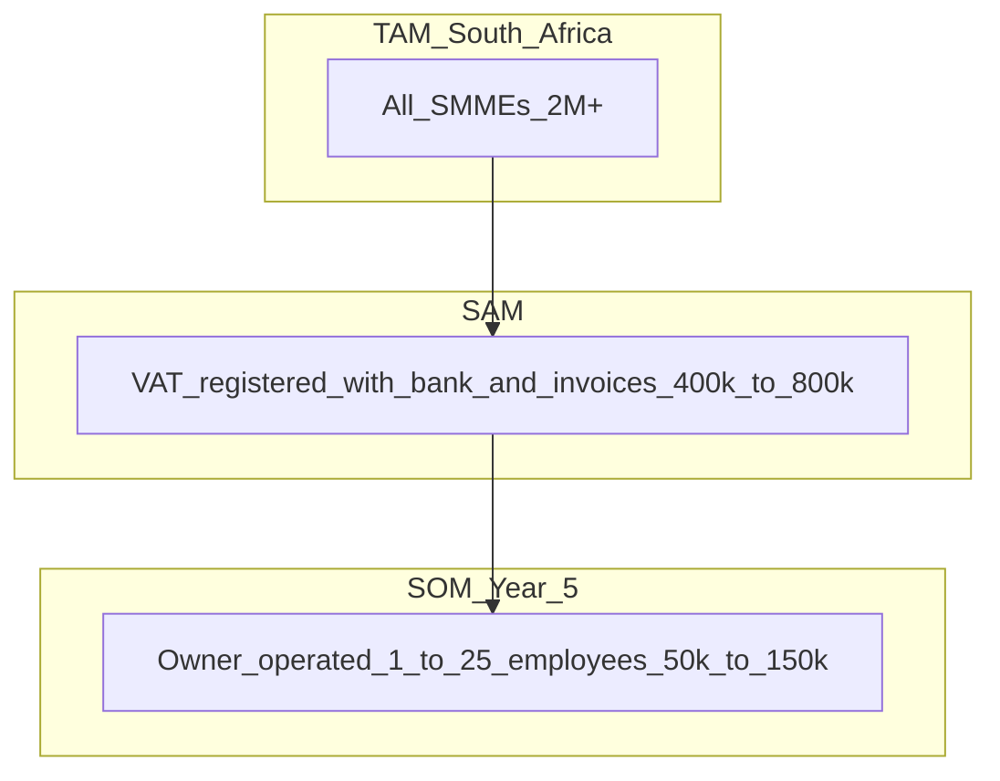

# AI Financial Operating System — Business Viability & Go-To-Market Strategy

**Sources:** [Due Diligence Audit Report](./due-diligence-audit.md) · [AI Financial OS Strategy](./ai-financial-os-strategy.md) · [Autonomous Bookkeeper Blueprint](./autonomous-bookkeeper-blueprint.md) · [AI Workforce Blueprint](./ai-workforce-blueprint.md) · [UX Architecture](./ai-financial-os-ux-architecture.md)  
**Lens:** Founder · VC · SME owner · Accountant · Product strategist · Pricing expert  
**Date:** June 2026  
**Status:** Business strategy document (no implementation commitments)

---

## Executive verdict

| Ambition | Viability | Conditions |
|----------|-----------|------------|
| **Profitable SaaS** | **High** | SA-first, vertical wedge, accountant channel, disciplined AI unit economics |
| **National software company** | **High** | Win 5–15% of addressable VAT-registered SMEs in 5–7 years |
| **International software company** | **Medium** | Requires proven playbook export; regulatory/localization per market; 3–5 year horizon after SA product-market fit |

**Why this can work:** The product solves a **behavioural** problem (owners hate accounting) with a **structural** solution (Autonomous Bookkeeper + AI workforce), on top of an **already-built accounting kernel** — a rare combination. Most competitors bolt AI onto accountant-centric UX.

**Why this can fail:** AI costs, trust gaps, accountant channel conflict, incumbent switching inertia, and building "too much product" before 100 paying customers.

---

## 1. Who would buy this product

### Primary buyer (pays and decides)

**The SME business owner-operator** — typically:

- 1–25 employees
- R500k–R30M annual revenue
- VAT-registered or approaching registration
- Uses a personal/business bank account + invoices + supplier bills
- Has **low accounting literacy** and **high time scarcity**
- Often mobile-first; WhatsApp-centric

**Psychographic:** "I run a business, not a finance department."

### Secondary influencer (does not pay initially, unlocks trust)

**The external accountant / bookkeeper** — wants:

- Clean, AI-prepared books
- Less data chasing
- Client stays compliant
- Professional tools (portal) without losing the client relationship

### Tertiary buyer (later)

- **Office manager / bookkeeper employee** at 10–50 employee firms
- **Franchise HQ** standardizing finance across outlets
- **Accountant firms** buying "client seats" in bulk (channel)

### Who would NOT buy (initially)

- Enterprise (>100 employees) — needs ERP
- Pure cash businesses with no VAT and no bank digital footprint
- Professional accountants looking for practice software (wrong product today)
- Complex manufacturers needing inventory/COGS depth on day one

---

## 2. Why they would buy it

### Owner motivations (emotional + rational)

| Pain today | What they buy |
|------------|---------------|
| Tax anxiety ("Am I going to get fined?") | **Confidence** — Tax tab + Aria + Vera |
| Time drain on admin | **Time back** — snap receipt, one-tap approve |
| Fear of looking unprofessional | **Polish** — fast invoices, chased payments |
| Confusion from accounting software | **Simplicity** — Today screen, plain English |
| Distrust of "black box" AI | **Explainability** — "Handled because…" |
| Cash surprises | **Foresight** — runway, bills due, collections |

**Core value proposition:** *"Run your business. We handle the money."*

Not: "Better bookkeeping."

### Quantified value (owner mental math)

For a typical R2M-revenue service business paying R3,000–R8,000/month for a bookkeeper + R500/month for software:

| Value lever | Monthly value to owner |
|-------------|------------------------|
| 5–10 hours saved on admin | R2,500–R5,000 (opportunity cost) |
| Reduced bookkeeper hours | R1,500–R4,000 |
| Faster collections (5–10 days DSO improvement) | R5,000–R20,000 cash unlocked |
| Avoided tax penalties / missed deadlines | R2,000+ (risk) |
| Reduced accountant clean-up fees | R500–R2,000 |

**Willingness to pay:** R499–R1,499/month is defensible if the product reliably delivers **2+ hours/week back** and **visible tax confidence**.

### Accountant motivations (channel)

- Clients arrive with organized data
- Less "shoebox accounting"
- Review queue instead of data entry
- Differentiation: "We use [Product] — your books run on autopilot"

---

## 3. Why they would switch from Sage, Xero, or QuickBooks

### Switching is hard — you need a **10x moment**, not 10% better

| Incumbent weakness | Your wedge |
|--------------------|------------|
| Built for accountants, tolerated by owners | Built for **owners**; accountants get a portal |
| Owner must learn accounting concepts | **Zero accounting vocabulary** |
| Modules don't talk (invoice ≠ bank ≠ GL) | **Autonomous Bookkeeper** unifies truth |
| AI = chat sidebar on stale data | AI = **orchestration layer** on live posted truth |
| Reconciliation is a chore | **One-tap approvals** replace reconciliation UX |
| Mobile is second-class | **Camera-first** capture is core |
| Generic global product | **SA-native:** VAT bi-monthly, local banks, PayFast, SARS readiness |
| Owner opens app with dread | Owner opens **Today** with relief |

### Switch triggers (when owners actually move)

1. **New business** — no migration pain (fastest)
2. **Accountant change** — new advisor recommends switch
3. **Tax scare** — penalty, missed VAT, SARS letter
4. **Growth pain** — volume of transactions overwhelms spreadsheets
5. **Frustration peak** — "I still don't know if I'm OK" on Xero dashboard
6. **Mobile moment** — owner tries to snap a receipt and hits a wall

### Honest switching barriers

| Barrier | Mitigation |
|---------|------------|
| Historical data migration | White-glove import + accountant-assisted onboarding |
| Accountant inertia | **Ellis portal** — make accountants heroes, not threatened |
| "AI will get tax wrong" | AB confidence gates + accountant sign-off on material items |
| Incumbent bundling | Don't compete on feature checklists — compete on **daily experience** |
| Price sensitivity | Prove ROI in first 14 days on Today screen |

**Positioning vs incumbents:** You are not "Xero with AI." You are **the app the owner actually wants to open** — incumbents would have to rebuild their entire UX and agent architecture to match.

---

## 4. Industries to target first

**Criteria:** high transaction volume, VAT-registered, mobile-heavy, owner-operated, low inventory complexity, fast time-to-value.

### Tier 1 — Launch verticals (months 0–12)

| Vertical | Why first |
|----------|-----------|
| **Professional services** (consultants, agencies, IT, marketing) | Simple revenue model; invoice-heavy; low COGS |
| **Trades & home services** (plumbers, electricians, cleaners) | Mobile capture; cash flow pain; many micro-SMEs |
| **Health & beauty** (salons, spas, clinics) | Owner-operators; appointment + invoice flow; high admin pain |
| **Freelancers / solopreneurs** (VAT-registered) | Fast onboarding; strong "I hate accounting" fit |

### Tier 2 — Expand (months 12–24)

| Vertical | Why next |
|----------|----------|
| **Retail (single-location)** | Higher volume; needs basic inventory later |
| **Hospitality (cafés, small restaurants)** | Daily cash flow; supplier bills; seasonal |
| **Property & facilities services** | Recurring invoices; predictable patterns |
| **E-commerce (SA Shopify/Woo)** | Integration story; digital-native buyers |

---

## 5. Industries to avoid initially

| Vertical | Why avoid (for now) |
|----------|---------------------|
| **Manufacturing / production** | Inventory, COGS, WIP — not in product today |
| **Wholesale / distribution** | Stock valuation, multi-warehouse |
| **Construction (large contracts)** | Progress billing, retentions, CIS-style complexity |
| **Farming / agriculture** | Specialized tax, seasonal, asset-heavy |
| **NGOs / grant-funded entities** | Fund accounting, donor restrictions |
| **Financial services / brokers** | Regulatory overhead beyond scope |
| **Payroll-heavy employers (50+ staff)** | No payroll module; high compliance stakes |
| **Import/export traders** | Customs, multi-currency complexity |

**Rule:** If the owner asks "how much stock do I have?" on day one — wrong vertical until Stock agent exists.

---

## 6. Industries with highest ROI

**Highest customer ROI** = time saved × cash improved × compliance risk reduced, divided by price.

| Rank | Vertical | ROI drivers |
|------|----------|-------------|
| 1 | **Professional services** | High invoice volume; clean AR; low complexity; fast autopilot |
| 2 | **Trades** | Many small transactions; receipt chaos; strong capture ROI |
| 3 | **Health & beauty** | Daily cash + tips + supplier bills; owner time extremely valuable |
| 4 | **E-commerce** | Payment matching at scale; integration leverage |
| 5 | **Property services** | Recurring revenue; predictable patterns = high automation rate |

**Highest ROI for your business (LTV/CAC):** Professional services and e-commerce — lower support burden, higher ARPU tolerance, faster expansion revenue (more users, integrations).

---

## 7. Industries that would adopt fastest

| Rank | Vertical | Adoption speed | Why |
|------|----------|----------------|-----|
| 1 | **New businesses / startups** | Fastest | No migration; greenfield |
| 2 | **Freelancers & solopreneurs** | Very fast | Simple needs; mobile-native |
| 3 | **Salons & beauty** | Fast | Owner feels pain daily; community word-of-mouth |
| 4 | **Trades** | Fast | Mobile; accountant often pushes software |
| 5 | **Digital agencies** | Fast | Tech-forward; tolerate AI earlier |

**Slowest adopters:** Established retailers with legacy Sage, payroll-heavy businesses, businesses with in-house bookkeepers loyal to incumbent workflows.

---

## A. Ideal Customer Profiles (ICPs)

### ICP 1 — "Thabo the Salon Owner"

| Attribute | Detail |
|-----------|--------|
| **Business** | 3–8 staff hair salon, R1.5–R4M revenue |
| **VAT** | Registered |
| **Stack today** | Excel + WhatsApp invoices OR basic Sage |
| **Pain** | Receipts in a shoebox; scared of VAT; no time |
| **Buying trigger** | Tax deadline anxiety or accountant frustration |
| **WTP** | R499–R799/month |
| **Success metric** | Opens Today daily; <3 approvals/week by month 2 |

### ICP 2 — "Nomsa the Consultant"

| Attribute | Detail |
|-----------|--------|
| **Business** | IT/marketing consultancy, solo or 2–5 people |
| **Revenue** | R800k–R5M |
| **Stack today** | Xero (underused) or spreadsheet |
| **Pain** | Sends invoices but doesn't reconcile; tax surprises |
| **Buying trigger** | Cash flow crunch or client payment delays |
| **WTP** | R699–R1,299/month |
| **Success metric** | Invoice-to-payment cycle visible; Aria answers tax questions |

### ICP 3 — "Pieter the Plumber"

| Attribute | Detail |
|-----------|--------|
| **Business** | Home services, 2–12 employees |
| **Pain** | Job site receipts; mixed personal/business spend |
| **Stack today** | Accountant does everything; owner disengaged |
| **Buying trigger** | Accountant recommends "stop bringing me bags of slips" |
| **WTP** | R499–R999/month (price-sensitive) |
| **Success metric** | 80%+ transactions captured via mobile |

### ICP 4 — "Thandi the Accountant" (channel ICP)

| Attribute | Detail |
|-----------|--------|
| **Practice** | 30–150 SME clients |
| **Pain** | Data chasing; low-margin bookkeeping |
| **Motivation** | Move clients to review-only; upsell advisory |
| **Buying model** | Recommends product; may pay for portal tier |
| **Success metric** | 10+ clients onboarded in 90 days |

---

## B. Market Segments

| Segment | Est. SA size | Fit | Priority |
|---------|--------------|-----|----------|
| **Micro (0–4 employees)** | Largest count | High if VAT-registered | PLG + mobile |
| **Small (5–19)** | Core sweet spot | **Highest** | Primary GTM |
| **Medium (20–49)** | Smaller count | Medium (needs payroll later) | Year 2+ |
| **Accountant channel** | ~15k–25k practices | High as amplifier | Parallel track |
| **Greenfield startups** | Growing | Very high | Accelerator partnerships |

**Beachhead SAM (realistic):** ~150,000–250,000 SA businesses that are VAT-registered, digitally banked, and owner-operated in target verticals.

**Year 5 SOM target:** 15,000–40,000 customers (6–16% of beachhead) = credible **national software company**.

---

## C. Vertical Market Opportunities

| Vertical | TAM (SA est.) | Product fit today | GTM motion | Priority |
|----------|---------------|-------------------|------------|----------|
| Professional services | 80k–120k | ★★★★★ | Content + accountant | **#1** |
| Trades & home services | 100k+ | ★★★★☆ | Trade associations, WhatsApp | **#2** |
| Health & beauty | 40k–60k | ★★★★★ | Instagram/community | **#3** |
| Freelancers / solopreneurs | 50k+ | ★★★★☆ | PLG, viral referral | **#4** |
| E-commerce | 20k–40k | ★★★☆☆ | Shopify/Woo integration | Year 2 |
| Retail single-store | 60k+ | ★★☆☆☆ | Wait for inventory | Year 2–3 |
| Hospitality | 30k+ | ★★★☆☆ | Seasonal campaigns | Year 2 |

**Vertical packaging strategy (HubSpot-style):** Same core product; different onboarding templates, category defaults, Aria prompts, and marketing landing pages per vertical.

---

## D. Competitive Advantages

### Structural moats (hard to copy)

| Advantage | Why it matters |
|-----------|----------------|
| **Owner-first UX architecture** | Incumbents are architecturally accountant-centric |
| **Autonomous Bookkeeper as execution layer** | Not a feature — a **system design** |
| **AI workforce orchestration (Nova + specialists)** | Depth competitors won't replicate with one chatbot |
| **Hidden GL kernel already built** | Faster to trustworthy autopilot than greenfield AI startups |
| **SA-native compliance** | VAT 201, bi-monthly periods, local payment rails |
| **Continuous close** | Owner never experiences "month-end" |

### Go-to-market moats (built over time)

| Advantage | Timeline |
|-----------|----------|
| Accountant channel + Ellis portal | 12–24 months |
| Vertical playbooks (salon, trades, etc.) | 6–18 months |
| Transaction pattern data (classification learning) | 18+ months |
| Brand: "the app owners love" | 24+ months |

### Positioning moat

**Category creation:** "Financial Operating System" — avoid competing in "accounting software" SEO and buyer mental models.

---

## E. Competitive Threats

| Threat | Severity | Response |
|--------|----------|----------|
| **Xero/Sage/Intuit add AI copilots** | High | Move faster on **autonomous execution**, not chat |
| **AI-native startups (no GL)** | Medium | Win on **trust + compliance + accountant channel** |
| **Free bank/cashflow apps** | Medium | Own **tax + invoices + full loop** |
| **Accountants resist AI** | High | Ellis portal; position as **practice uplift**, not replacement |
| **AI cost / margin squeeze** | Medium | Rules-first pipeline; LLM only where needed (per AB blueprint) |
| **Trust failure (wrong VAT post)** | Critical | Confidence gates; accountant sign-off; insurance narrative |
| **SA macro / SME churn** | Medium | Annual plans; prove cash ROI |
| **International players discount** | Low in SA | Local support, SARS, banks win |

**Biggest existential risk:** Shipping "AI accounting" before **trust loops** work — one viral "it categorized my rent wrong" story kills PLG in SA's tight business communities.

---

## F. Go-To-Market Strategy

### Phase 0 — Wedge (months 0–6): First 100 customers

**Motion:** Founder-led, high-touch, single vertical.

| Tactic | Detail |
|--------|--------|
| **Pick one vertical** | Professional services OR salons (not both) |
| **City cluster** | Johannesburg OR Cape Town — density beats reach |
| **Founder sales** | 50 demos; 30 trials; 100 paid |
| **Accountant pilot** | 5 firms × 10 clients each = 50 seats |
| **"Tax confidence" marketing** | Content: VAT anxiety, not feature lists |
| **14-day trial** | Must reach "Today with real bank data" in session 1 |
| **WhatsApp-native workflows** | Send invoice via WhatsApp — SA-specific delight |
| **Referral loop** | "Give a month, get a month" after first VAT period survived |

### Phase 1 — PLG + channel (months 6–18): 100 → 1,000

| Motion | Detail |
|--------|--------|
| **Self-serve onboarding** | <10 min to value |
| **Vertical landing pages** | Salon, consultant, trades |
| **Accountant partner program** | Certified partner badge; rev share on referrals |
| **Community** | Owner finance tips (not accounting education) |
| **Case studies** | "Thabo saved 8 hours/month" — behavioural proof |

### Phase 2 — National (months 18–36): 1,000 → 10,000

| Motion | Detail |
|--------|--------|
| **Paid acquisition** | Facebook/Instagram/Google — vertical creatives |
| **Bank/fintech partnerships** | Co-marketing with neobanks |
| **PayFast / payment links** | Invoice paid → retention hook |
| **Accountant bulk onboarding** | Firm imports 50 clients |

### Phase 3 — Regional expansion (year 3–5): International path

| Market | Rationale |
|--------|-----------|
| **Namibia, Botswana, Kenya, Nigeria** | English; growing SME digitization |
| **UK / Australia** | English; VAT similarities — but **fierce competition** |
| **Not US first** | Intuit dominance; regulatory cost |

**International playbook:** Export **product architecture** (AB + workforce + Today UX); rebuild **tax/compliance layer** per country. Brand as "Financial OS" not "SA accounting."

### GTM principles (Salesforce / HubSpot DNA)

1. **Land with pain** — tax anxiety, cash fear, time drain
2. **Expand with autopilot** — more automation = more stickiness
3. **Channel is force multiplier** — accountants are trust brokers in SA
4. **Product is the marketing** — Today screen screenshots sell better than feature grids

---

## G. Pricing Strategy

### Pricing philosophy

| Principle | Application |
|-----------|-------------|
| **Price on outcomes, not seats** | Core tier by business activity, not user count |
| **Anchor against bookkeeper cost** | "Less than 2 hours of bookkeeper time" |
| **Free trial, not freemium** | Accounting needs trust — avoid race to bottom |
| **Annual discount** | 2 months free — improves cash flow, reduces churn |
| **Accountant channel pricing** | Separate portal tier or per-client fee |
| **AI is included** | Don't nickel-and-dime per Aria message |

### Competitive price anchors (SA, 2026)

| Competitor | Typical range |
|------------|---------------|
| Xero SA | R400–R900/month |
| Sage | R500–R1,200/month |
| QuickBooks | R350–R800/month |
| Bookkeeper | R2,000–R6,000/month |

**Positioning:** Premium to basic accounting (10–30% above entry Xero), **dramatically below** bookkeeper replacement.

---

## Pricing tiers

### Tier 1 — Solo — R449/month (R4,490/year)

| Dimension | Detail |
|-----------|--------|
| **Target** | Solopreneur, freelancer, 0–2 employees |
| **Included** | Today, Money, Get Paid (50 invoices/mo), Pay (30 bills/mo), Tax status, Aria (core Q&A), document capture (100/mo), 1 bank account, 1 user |
| **Value delivered** | "I know my cash and tax status without a bookkeeper" |
| **Expected savings** | 3–5 hrs/month; R1,500+ admin cost |

### Tier 2 — Run — R899/month (R8,990/year) — Primary tier / hero

| Dimension | Detail |
|-----------|--------|
| **Target** | Owner-operated SME, 3–15 employees, ICP sweet spot |
| **Included** | Everything in Solo + unlimited invoices/bills, 3 bank accounts, 3 users, collections reminders, cash forecast (30-day), auto-categorization, accountant invite (1), priority support |
| **Value delivered** | "My finances run on autopilot — I just approve" |
| **Expected savings** | 8–12 hrs/month; faster collections; tax confidence |

### Tier 3 — Grow — R1,499/month (R14,990/year)

| Dimension | Detail |
|-----------|--------|
| **Target** | Growing SME 10–25 employees, multi-user, higher volume |
| **Included** | Everything in Run + 5 users, 90-day forecast, anomaly guard, payment scheduling, integrations (e-commerce, PayFast), advanced insights, multiple approval workflows |
| **Value delivered** | "A virtual finance department without hiring" |
| **Expected savings** | Partial bookkeeper replacement; R5,000–R15,000/month value |

### Tier 4 — Scale — R2,499/month (R24,990/year)

| Dimension | Detail |
|-----------|--------|
| **Target** | 20–50 employees, multi-location, franchise unit |
| **Included** | Everything in Grow + unlimited users, API access, dedicated onboarding, SLA, multi-entity (future), custom approval limits, advanced audit export |
| **Value delivered** | "Finance operations at scale without an ERP" |
| **Expected savings** | Finance team efficiency; compliance at scale |

### Partner tier — Accountant Portal — R1,999/month + R99/client/month

| Dimension | Detail |
|-----------|--------|
| **Target** | Accounting firms managing 20–200 clients |
| **Included** | Multi-client console, review queue, GL/TB/VAT 201 tools, bulk client onboarding, white-label option (later) |
| **Value delivered** | "Review, don't chase — AI-prepared books" |
| **Expected savings** | 40–60% reduction in bookkeeping hours per client |

---

## Revenue estimates

### Assumptions (blended ARPU model)

| Customers | Tier mix assumption | Blended ARPU/month | MRR | ARR (ZAR) | ARR (USD ~R18.5) |
|-----------|---------------------|-------------------|-----|-----------|------------------|
| **100** | 40% Solo, 45% Run, 15% Grow | R750 | **R75,000** | **R900,000** | ~$49k |
| **1,000** | 25% Solo, 50% Run, 20% Grow, 5% Scale | R950 | **R950,000** | **R11.4M** | ~$616k |
| **10,000** | 20% Solo, 45% Run, 25% Grow, 10% Scale | R1,100 | **R11M** | **R132M** | ~$7.1M |
| **100,000** | 15% Solo, 40% Run, 30% Grow, 15% Scale | R1,250 | **R125M** | **R1.5B** | ~$81M |

*Excludes accountant portal revenue, which at scale could add 15–25% on top.*

### Profitability snapshot (VC lens)

| Scale | MRR | Est. gross margin | Notes |
|-------|-----|-------------------|-------|
| 100 | R75k | 50–60% | Founder-led; high support cost |
| 1,000 | R950k | 65–75% | Support automation; AI costs optimized |
| 10,000 | R11M | 70–80% | National company; channel leverage |
| 100,000 | R125M | 75–85% | International scale potential |

**Break-even (rough):** ~400–800 customers at R950 ARPU with a lean team (15–25 people) and controlled CAC — achievable in 24–36 months post-launch.

**National company threshold:** ~5,000–10,000 paying customers OR R100M+ ARR.

**International credibility threshold:** $10M+ ARR with >20% from second market.

---

## Fastest path to the first 100 paying customers

### The 90-day playbook

### Step 1 — Pick one vertical + one city (week 1)

**Recommendation:** **VAT-registered professional services in Johannesburg** OR **salons in Cape Town**.

Why: highest ROI, fast adoption, accountant density, word-of-mouth in tight communities.

### Step 2 — Build a list of 300 targets (weeks 1–2)

| Source | Count |
|--------|-------|
| LinkedIn / Instagram local businesses | 100 |
| Accountant firm introductions | 50 |
| Business networks (BNI, chambers) | 50 |
| Your personal network | 50 |
| Cold walk-ins (salons, trades) | 50 |

### Step 3 — Offer a "Founding 100" deal (weeks 2–12)

| Offer element | Detail |
|---------------|--------|
| **Price** | R449/month locked for life (Run tier features) |
| **Trade** | Weekly 15-min feedback call for 8 weeks |
| **Promise** | "Tax confidence in 30 days or we refund" |
| **Onboarding** | White-glove: founder sets up bank + first invoice in call |

**Why this works:** SA owners buy **trust and hand-holding** early; you buy **learning and case studies**.

### Step 4 — Accountant wedge (parallel)

Recruit **5 accountant partners** with this pitch:

> "Your clients stop bringing shoeboxes. You review AI-prepared books in our portal. You keep the relationship. First 10 clients free for 3 months."

**Math:** 5 accountants × 10 clients = 50 customers before direct PLG kicks in.

### Step 5 — Daily demo rhythm (weeks 4–12)

| Activity | Volume |
|----------|--------|
| Demos (30 min) | 4/day × 40 days = 160 |
| Trial starts | 50% = 80 |
| Trial → paid | 60% = 48 direct |
| Accountant channel | 50 |
| Referrals | 2 per 10 customers = ~10 |
| **Total** | **~100+** |

### Step 6 — One killer demo moment

Don't demo the ledger. Demo this sequence in 5 minutes:

1. Open **Today** — "This is your business command center"
2. Snap a receipt — bill appears
3. One-tap approve
4. Ask Aria: "How much tax this month?"
5. Show payment matched overnight

**Owner reaction:** "That's not accounting software. That's what I need."

### Step 7 — Retention before acquisition

First 100 matter more than next 1,000. **Churn kills SA SMB SaaS.**

| Retention hook | When |
|----------------|------|
| First bank sync | Day 1 |
| First invoice sent | Day 3 |
| First approval | Day 7 |
| First "all good" on Today | Day 14 |
| First VAT period survived | Day 45 |

---

## Final answers

### Can this become a profitable SaaS company?

**Yes.** The product addresses a **high-frequency, high-anxiety job** (business finances) with a **defensible architecture** (AB + workforce) and **credible price point** (R449–R1,499/month vs R3,000+ bookkeeper). Profitability is realistic at **400–800 customers** with disciplined CAC and AI unit economics.

### Can this become a national software company?

**Yes.** SA's addressable market supports **15,000–40,000 customers** in the beachhead. At R1,000 blended ARPU, that is **R180M–R480M ARR** — a genuine national software business by SA standards. The accountant channel accelerates distribution in a trust-driven market.

### Can this become an international software company?

**Yes, but not on day one.** Export the **Financial OS model** (Today + Aria + AB + workforce), not the SA tax engine. Target English-speaking emerging markets first (Namibia, Kenya, Nigeria), then evaluate UK/Australia. **$50M–$100M ARR** is plausible in 7–10 years if SA product-market fit is proven first.

### The one strategic decision that matters most

**Win the owner's morning.**

If Thabo opens Today at 7:30am and feels relief — you have a company.  
If he opens Xero and feels dread — you don't, regardless of AI features.

---

## Related documents

| Layer | Document |
|-------|----------|
| Current state | [Due Diligence Audit](./due-diligence-audit.md) |
| Product strategy | [AI Financial OS Strategy](./ai-financial-os-strategy.md) |
| Execution engine | [Autonomous Bookkeeper Blueprint](./autonomous-bookkeeper-blueprint.md) |
| Virtual department | [AI Workforce Blueprint](./ai-workforce-blueprint.md) |
| Owner experience | [UX Architecture](./ai-financial-os-ux-architecture.md) |
| **Business & GTM** | **This document** |

---

*Business viability, market fit, and growth strategy only. No implementation guidance. Aligns with prior strategy, AB, workforce, and UX documents.*
