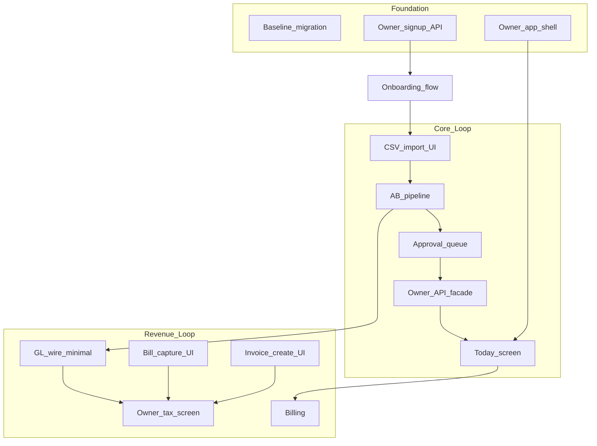

# AI Financial Operating System — MVP Gap Analysis

**Sources:** [Due Diligence Audit Report](./due-diligence-audit.md) · [MVP Launch Plan](./ai-financial-os-mvp-launch-plan.md) · current codebase  
**Reviewer lens:** CTO + product delivery  
**Date:** June 2026  
**Status:** Gap analysis and sprint plan (no implementation commitments)

---

## Executive summary

| Dimension | Status |
|-----------|--------|
| **Accounting kernel** | ~70% built (GL, VAT, AR/AP, banking APIs) |
| **Owner Financial OS** | ~5% built (shared auth, data models, some APIs with no UI) |
| **Killer feature (Today + autopilot + approvals)** | **0%** as a product surface |
| **Ready for one paying customer today** | **No** — wrong persona, wrong nav, no Today, no signup, no billing, no approvals |
| **Realistic time to first paying customer** | **8–10 weeks** with 2 engineers + founder sales (not 90 days to 30 paying if starting from zero owner UI) |

**Brutal truth:** You have a **solid accountant backend** and **almost zero owner product**. The MVP is ~**70% net-new UX** and ~**40% net-new backend orchestration**, not a re-skin.

**Shortest path to one real paying customer:** Ship **Today v0 + CSV bank import + approval cards + invoice create** on an **owner shell** (hide ledger/console). Defer Aria, billing automation, OCR, GL wire, and accountant portal. Take payment manually (Paystack link) for customer #1 while Stripe integration ships in parallel.

---

## 1. MVP features that already exist

| MVP feature | What exists | Location |
|-------------|-------------|----------|
| **Auth (login)** | Local JWT + optional Supabase token exchange | `apps/api/src/auth/`, `apps/web/src/app/login/` |
| **Company tenancy** | Firm/company/membership + `assertCompanyAccess` | Prisma schema, all services |
| **Bank accounts** | CRUD API, balance from txns | `banking.service.ts` |
| **Bank CSV import** | `POST .../import` parses rows, applies rules | `banking.service.ts:76–101` |
| **Bank rules** | Text match → GL account + VAT code on txn | `banking.service.ts:103–117` |
| **Bank transactions** | List, create, mark reviewed/reconciled | API complete |
| **Sales — customers/suppliers/items** | List + create APIs | `sales.service.ts` |
| **Sales — invoices & bills** | Create, list, allocate payment APIs | `sales.service.ts` |
| **VAT engine** | Periods, VAT 201 calc from invoices/bills | `vat.service.ts` |
| **Cash + VAT KPIs** | `cashPosition`, `vatPayable`, overdue counts | `dashboard.service.ts` |
| **Audit trail** | `AuditService` on mutations | `audit.service.ts` |
| **File storage** | Supabase bank statement upload | `storage.controller.ts` |
| **Reports export** | JSON/PDF/XLSX for 6 report types | `reports.service.ts` |
| **GL engine** | Journals, post, trial balance | `ledger.service.ts` (not wired to bank/AR/AP) |
| **UI component library** | DataTable, KpiCard, StatusBadge, etc. | `packages/ui` |

**Verdict:** Backend **substrate** for MVP is real. Owner **experience** is not.

---

## 2. MVP features that partially exist

| MVP feature | Exists | Missing | Gap severity |
|-------------|--------|---------|--------------|
| **Bank ingest (CSV)** | API `importCsv` | No web client method; banking UI uploads to **Storage**, not CSV import | **High** |
| **Rules + classify** | `applyRules` on import/create | No confidence score, no auto vs approval split, accountant `NEW/REVIEWED` UX | **High** |
| **Transaction labels** | `payee`, `description`, `selection.account` | No plain-language owner labels; exposes reconciliation states | **Medium** |
| **Tax status card** | `getKpis` + `calculateVat201` | Accountant VAT wizard UI; estimate not on owner Tax screen; calc from invoices/bills only (not bank-approved truth) | **Medium** |
| **Money view** | `/banking` page | Reconciliation workflow, not owner money in/out | **High** |
| **Get Paid / Pay** | Read-only invoice/bill lists | No create, approve, capture flows in UI | **Critical** |
| **Auth** | Login for demo accountant | No signup, no owner onboarding, login copy is accountant-centric | **Critical** |
| **Accountant handoff** | `reports/generate` per report | No bundled export pack, no owner-facing "send to accountant" | **Low** (MVP) |
| **Bill capture** | Storage upload | Not linked to `createBill`; no owner capture flow | **High** |
| **Dashboard / home** | `/dashboard` KPIs | Accountant metrics; not Today command center | **High** |
| **Supabase auth** | Client + API exchange | No registration flow in product | **Medium** |

---

## 3. MVP features completely missing

| MVP feature | Effort (person-days) | Notes |
|-------------|---------------------|-------|
| **Today screen** | 8–12 | New page + aggregation; killer feature shell |
| **Owner app shell** (4-tab nav, hide ledger) | 5–8 | Replace `app-shell.tsx`, redirect `/` → `/today` |
| **Owner onboarding** (5 steps) | 8–12 | New routes + company create API (no register endpoint today) |
| **Owner API façade** (`/owner/today`, actions) | 5–8 | New NestJS module |
| **AB pipeline + approval queue** | 10–15 | New Prisma models, classify → queue → resolve |
| **Approval cards UI** (one-tap) | 5–8 | Core interaction |
| **Invoice create + send UI** | 8–12 | API exists; need forms, PDF, email |
| **Bill capture + approve UI** | 6–10 | Form + optional OCR hook |
| **Aria (10 canonical Q&A)** | 5–8 | Template router; LLM optional |
| **Owner Tax screen** | 3–5 | Plain English wrapper on existing VAT data |
| **Billing (Stripe/Paystack)** | 8–12 | Subscription model, webhooks, paywall |
| **GL wire (bank/bill approve → journal)** | 10–15 | `journalEntryId` field exists but never set from banking/sales |
| **Owner signup / register API** | 3–5 | Only `login` + `supabase` today |
| **CSV import UI + bank templates** | 3–5 | Wire client to existing API |
| **Critical path tests** | 5–8 | Zero project tests today |
| **Baseline Prisma migration** | 2–3 | `db push` only today |

**Total net-new (Tier 0):** ~**95–130 person-days** (~**19–26 weeks** for 1 FTE, ~**10–13 weeks** for 2 FTEs excluding parallel work and bugfix buffer).

---

## 4. Effort summary by workstream

| Workstream | Days (range) | Priority |
|------------|--------------|----------|
| Owner shell + navigation | 5–8 | P0 |
| Today + owner façade API | 13–20 | P0 |
| AB pipeline + approvals | 10–15 | P0 |
| CSV import UI | 3–5 | P0 |
| Invoice create/send UI | 8–12 | P0 |
| Onboarding + signup | 11–17 | P0 |
| GL minimal wire | 10–15 | P1 (P0 for tax trust at scale) |
| Bill capture/approve UI | 6–10 | P1 |
| Tax owner screen | 3–5 | P1 |
| Aria 10Q | 5–8 | P2 for customer #1 |
| Billing | 8–12 | P1 for self-serve; defer for manual #1 |
| Export pack | 3–5 | P2 |
| Tests + migrations | 7–11 | P1 before launch |

---

## 5. Dependencies

**Critical path:** `Owner shell` → `CSV UI` → `AB pipeline` → `Approval queue` → `Owner façade` → `Today` → (demo) → `Invoice UI` → `Onboarding`

**GL wire** is parallel but **tax credibility** depends on it for bank-driven businesses. For consultants (invoice-heavy), existing VAT calc from invoices may suffice for customer #1.

---

## 6. Recommended build order

| Order | Item | Why |
|-------|------|-----|
| 1 | Owner shell; hide `/ledger`, `/console`, `/vat`; redirect home → `/today` | Stops shipping accountant product |
| 2 | CSV import UI → existing API | Unblocks real data |
| 3 | AB pipeline v0 (rules-only, queue NEW txns without category) | Backend for killer feature |
| 4 | Owner façade + Today v0 (cash, N need you, activity) | Demoable wedge |
| 5 | Approval card UI (approve = set category + mark handled) | One-tap magic |
| 6 | Invoice create UI (API already there) | Second demo moment |
| 7 | Signup + onboarding flow | Self-serve |
| 8 | Owner Tax screen (wrap `getKpis` + `calculateVat`) | Tax confidence |
| 9 | Bill capture form (manual fields, no OCR) | Pay tab minimum |
| 10 | GL wire on approve | Trust at scale |
| 11 | Billing | Monetization |
| 12 | Aria 10Q, export pack, Tier 1 features | Polish |

---

## Shortest path to one paying customer

**Target:** One VAT-registered consultant, founder-hand-held, R449/month.

| Week | Ship | Skip |
|------|------|------|
| 1–2 | Owner shell + CSV import + Today v0 + approvals | Aria, billing, OCR |
| 3 | Invoice create + PDF download | Email automation (WhatsApp share OK) |
| 4 | Onboarding + Tax card + mobile polish | GL wire (use invoice-based VAT) |
| 5 | Founder onboard 3–5 design partners | Stripe (manual Paystack invoice) |
| 6–8 | First **paid** conversion + GL wire + billing | Second vertical |

**Minimum demo that closes one sale:**

1. Upload bank CSV → transactions appear
2. Today: "R84,200 cash · 8 handled · 2 need you"
3. Tap approve → Done
4. Create invoice → PDF
5. Tax: "~R6,400 VAT this period"

**Customer #1 can pay via manual invoice** while billing ships in sprint 5–6.

---

## Biggest risks

| Risk | Impact | Mitigation |
|------|--------|------------|
| Building accountant UI fixes instead of owner rebuild | Fatal | Freeze `/ledger`, `/console`; new routes only |
| AB pipeline scope creep (full workforce) | 4+ week slip | One service, rules-only v0 |
| No signup — only demo login | Can't onboard real owners | Supabase signup or `POST /auth/register` week 3–4 |
| VAT wrong for bank-heavy users without GL wire | Trust loss | Lead with invoice-heavy ICP; wire GL by customer #5 |
| Zero tests | Production embarrassment | 10 critical-path tests before first paying user |
| CSV friction | Onboarding fails | Founder uploads CSV on Zoom for first 20 users |

---

## Biggest distractions to avoid

- Nova / multi-agent architecture
- Accountant portal / firm console redesign
- Open Banking integrations
- OCR / Document AI perfection
- Open-ended Aria chat
- PayFast, collections automation, undo, WhatsApp (Tier 1)
- Rebuilding reports / P&L for owners
- Role enforcement, multi-user
- CI/CD perfection before launch

---

## Sprint 1 (Days 1–14) — Foundation + data in

**Objective:** Owner can log into a non-accountant shell and import bank CSV; backend classifies with rules.

### Deliverables

- Owner `AppShell` (Today, Money, Get Paid, Pay, More)
- Hide accountant routes from nav; `/` → `/today`
- `importCsv` in web API client + upload UI with FNB/Std/Nedbank template docs
- `owner` module skeleton + `GET /owner/health`
- AB service v0: on import, run rules; flag uncategorized as `PENDING_OWNER`
- Prisma: `OwnerAction` model (type, status, bankTxnId, question, choices)
- Baseline migration

### Acceptance criteria

- [ ] New user sees no "General Ledger" or "Company Console" in nav
- [ ] CSV import creates txns; rules auto-set `selectionId` where matched
- [ ] Uncategorized txns create `OwnerAction` rows
- [ ] No regressions on existing API login

### Risks

Firm/company model assumes accountant seed — may need `POST /companies` for owner signup in sprint 2.

---

## Sprint 2 (Days 15–28) — Today + approvals (killer feature)

**Objective:** Today screen delivers the "while you slept" moment with one-tap approvals.

### Deliverables

- `GET /owner/today` — cash, handled count, open actions, recent activity
- `/today` page: health strip, approval cards, handled summary, activity feed
- `POST /owner/actions/:id/resolve` — approve with plain category
- Money tab v0: plain-language txn list (no NEW/REVIEWED tabs)
- Map GL account names → owner categories ("Rent", not "6100")
- 5 integration tests: import → queue → resolve

### Acceptance criteria

- [ ] Today loads <3s with 50 txns
- [ ] "N needs you" matches open `OwnerAction` count
- [ ] One-tap approval clears card and updates activity
- [ ] Zero UI strings: debit, credit, reconcile, journal

### Risks

Performance of aggregation queries; may need caching on Today endpoint.

---

## Sprint 3 (Days 29–42) — Get Paid + onboarding

**Objective:** Owner can sign up, onboard, and send an invoice.

### Deliverables

- `POST /auth/register` or Supabase signup flow
- Onboarding wizard (5 steps) → lands on Today
- `POST /companies` for new owner (single company, no firm console)
- Invoice create form + wire to `sales.createInvoice`
- Invoice PDF generation (new endpoint or client-side)
- Get Paid tab: list + create + detail
- Login page rebrand (owner, not accountant)

### Acceptance criteria

- [ ] New owner completes onboarding in <15 min (with CSV)
- [ ] Invoice created and PDF downloadable in <2 min
- [ ] Demo credentials flow still works for dev

### Risks

Company creation may require firmId in schema — check seed vs new owner path.

---

## Sprint 4 (Days 43–56) — Pay + Tax + GL wire start

**Objective:** Bills and tax confidence; books start connecting.

### Deliverables

- Pay tab: bill list + manual capture form → `createBill`
- Bill approve → `OwnerAction` or direct approve endpoint
- `/tax` owner screen: estimate, due date, on-track status
- GL wire: on bank txn approve → create + post journal, set `journalEntryId`
- GL wire: on bill approve → expense journal
- Today "coming up" strip (bills due, VAT date from company)

### Acceptance criteria

- [ ] Bill captured and approved end-to-end
- [ ] Tax screen shows VAT estimate from existing engine
- [ ] Approved bank txn has `journalEntryId` populated
- [ ] 10 design partners onboarded (founder-led)

### Risks

GL wire is highest technical risk; may slip to sprint 5 without blocking customer #1 if ICP is invoice-heavy.

---

## Sprint 5 (Days 57–70) — Monetization + Aria + polish

**Objective:** Take payment; add lightweight intelligence; production hardening.

### Deliverables

- Stripe or Paystack subscriptions (Solo R449 / Run R899)
- Paywall after 14-day trial
- Aria widget: 10 templated Q&A from `/owner/aria/ask`
- Accountant export pack (zip: bank CSV + invoices + VAT PDF)
- Mobile responsive pass on Today + approvals
- Payment match rule (exact ref + amount → invoice)
- Bug bash + P0 fixes from design partners

### Acceptance criteria

- [ ] Trial → paid conversion works
- [ ] Aria answers "How much cash?" and "How much tax?" from live data
- [ ] Export pack downloadable
- [ ] ≥7/10 design partners say they'd pay R449

### Risks

Payment provider SA setup delays — keep manual invoicing fallback.

---

## Sprint 6 (Days 71–84) — Launch

**Objective:** First paying customers; founding cohort live.

### Deliverables

- Landing page + founding 100 offer
- Production deploy (Vercel + API + Supabase)
- Monitoring / error tracking (basic)
- Collections reminder draft (Tier 1, if time)
- Case study from best design partner
- Freeze feature scope; fix only P0/P1

### Acceptance criteria

- [ ] ≥30 paying customers OR ≥10 paying + pipeline of 20 trials (10 paying is more realistic for 2 engineers)
- [ ] Week-2 retention ≥60%
- [ ] Support tickets with accounting jargon ≈ 0
- [ ] Founder can run 5-min demo without ledger

### Risks

30 paying in 90 days needs aggressive founder sales; **10 paying is realistic** for 2 engineers.

---

## Gap scorecard (MVP Tier 0 checklist)

| Feature | Status | Sprint |
|---------|--------|--------|
| Today screen | ❌ Missing | 2 |
| Owner shell | ❌ Missing | 1 |
| Owner onboarding | ❌ Missing | 3 |
| Bank CSV UI | ⚠️ Partial (API only) | 1 |
| Rules + classify | ⚠️ Partial | 1–2 |
| Approval queue | ❌ Missing | 1–2 |
| Invoice create/send | ⚠️ API only | 3 |
| Bill capture/approve | ⚠️ API only | 4 |
| Tax status (owner) | ⚠️ Backend only | 4 |
| Aria 10Q | ❌ Missing | 5 |
| Auth signup | ❌ Missing | 3 |
| Billing | ❌ Missing | 5 |
| Accountant export | ⚠️ Reports exist | 5 |
| GL wire | ❌ Missing | 4 |
| AB pipeline | ❌ Missing | 1–2 |

---

## CTO bottom line

**You are not 90 days from MVP. You are ~10–12 weeks from a credible founding customer demo and ~14–16 weeks from self-serve paid launch** with 2 engineers — **if** you resist building the full AI workforce and accountant surfaces.

**The codebase saves you:** double-entry, VAT, AR/AP, banking import, rules — roughly **8–12 weeks** vs greenfield.

**The codebase does not save you:** Today, approvals, owner UX, onboarding, billing, orchestration — the entire **reason to pay**.

**Start with Sprint 1.** Do not touch the ledger UI. Do not build Nova. Ship Today with real CSV data in 28 days or reassess.

---

## Related documents

| Layer | Document |
|-------|----------|
| Current state | [Due Diligence Audit](./due-diligence-audit.md) |
| MVP scope | [MVP Launch Plan](./ai-financial-os-mvp-launch-plan.md) |
| Product strategy | [AI Financial OS Strategy](./ai-financial-os-strategy.md) |
| Owner experience | [UX Architecture](./ai-financial-os-ux-architecture.md) |
| Business & GTM | [Business Strategy](./ai-financial-os-business-strategy.md) |
| **Gap analysis & sprints** | **This document** |

---

*Codebase evaluation and delivery plan only. No implementation guidance. Aligns with MVP launch plan and due diligence audit.*
