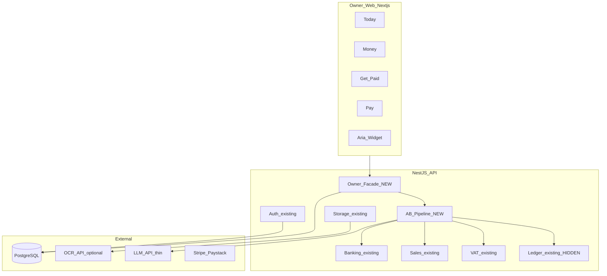
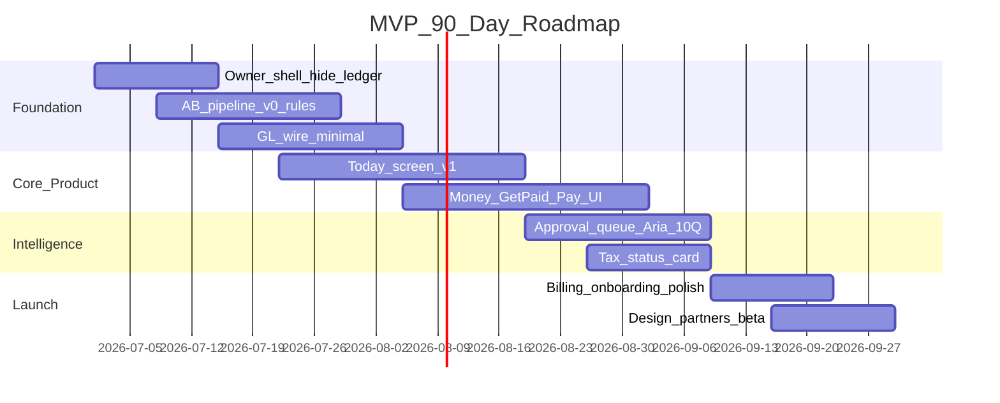

# AI Financial Operating System — 90-Day MVP Launch Plan

**Sources:** [Due Diligence Audit Report](./due-diligence-audit.md) · [AI Financial OS Strategy](./ai-financial-os-strategy.md) · [Autonomous Bookkeeper Blueprint](./autonomous-bookkeeper-blueprint.md) · [AI Workforce Blueprint](./ai-workforce-blueprint.md) · [UX Architecture](./ai-financial-os-ux-architecture.md) · [Business Strategy](./ai-financial-os-business-strategy.md)  
**Constraint:** 90 days · small team (assume 2–4 builders + founder) · venture-backed launch mindset  
**Date:** June 2026  
**Status:** MVP launch plan (no implementation commitments)

---

## Executive summary

**MVP name internally:** *Today* (the product is experienced through the Today screen; everything else supports it)

**One-sentence MVP:**  
*A South African SME owner connects their bank, sees plain-language money in/out, approves what the system can't handle automatically, sends invoices, captures bills, and knows their VAT position — without ever seeing accounting software.*

**Killer feature (what makes them pay immediately):**

> **Overnight Autopilot on Today — "While you slept, we handled your finances."**

Not generic AI chat. Not another invoice tool. The moment an owner opens the app and sees **cash + tax status + "12 handled, 1 needs you"** with **one-tap approve**, they feel the Financial OS. That replaces dread with relief — and replaces 2–5 hours of bookkeeper work per week.

**Launch price:** R449/month Founding 100 (Run-tier scope) — sell from day 60 with 14-day trial.

**What you are NOT launching:** multi-agent workforce, accountant portal, bank Open Banking, eFiling, payroll, full autonomous posting, native mobile app.

---

## A. MVP Definition

### Purpose

Prove three things in 90 days:

1. **Owners will pay** for a non-accounting finance experience
2. **The Autonomous Bookkeeper concept works** at minimum viable depth (rules-first, human confirm)
3. **The codebase can be re-platformed** without a rewrite

### MVP success criteria (launch gate)

| Metric | Target |
|--------|--------|
| Paying customers at day 90 | ≥ 30 (path to 100 by day 120) |
| Time to first value | < 15 minutes in onboarding call |
| Week-2 retention | ≥ 60% of trials still active |
| Today opens per week | ≥ 4 per active owner |
| Approvals completed | ≥ 80% of queued items within 48h |
| Support tickets mentioning debit/credit/ledger | ≈ 0 |
| Demo conversion (trial → paid) | ≥ 40% (founder-led) |

### MVP persona (only one)

**VAT-registered professional services owner** — consultant, agency, freelancer with 1–10 staff, Johannesburg or Cape Town. Not salons yet. Not trades yet. **One vertical, one city.**

### MVP promise (marketing)

*"Open Today. Know you're OK. Approve one tap. Never think about bookkeeping again."*

---

## B. Features included in MVP

### Tier 0 — Must ship (non-negotiable)

| Feature | MVP scope | Reuse from codebase |
|---------|-----------|---------------------|
| **Today screen** | Health strip, cash, approval cards, activity feed, handled summary | New UI; aggregate from banking + sales + VAT APIs |
| **Owner onboarding** | 5 steps: business → VAT yes/no → CSV bank → first invoice optional → Today | New flow; single company (not firm console) |
| **Owner app shell** | 4 tabs: Today, Money, Get Paid, Pay (+ More: Tax, Settings) | Replace accountant sidebar; **hide** `/ledger`, `/console`, `/vat` wizard |
| **Bank ingest** | CSV upload only (Nedbank/Std/FNB template docs) | Existing `banking` import API |
| **Transaction labels** | Plain-language list (money in/out) | Banking API + new owner labels |
| **Rules + classify** | Bank rules engine + simple pattern match | Existing `BankRule` |
| **Approval queue** | Owner confirms unknown/large txns | New thin AB queue (not full agent stack) |
| **Create & send invoice** | Customer pick/create, lines, PDF, email | Sales API exists — **build UI** |
| **Bill capture** | Photo/PDF upload → manual confirm fields (OCR assist optional) | Storage API + sales bills API |
| **Bill approve** | One-tap approve bill | Wire to sales API |
| **Tax status card** | Estimated VAT payable + due date (plain English) | VAT periods API + dashboard aggregates |
| **Aria (minimal)** | 10 canonical questions, templated answers from live data | New; LLM for phrasing only |
| **Auth** | Signup/login (Supabase or local JWT) | Existing auth module |
| **Billing** | Stripe or Paystack subscription — 2 tiers only (Solo/Run) | New |
| **Accountant handoff** | Export pack: transactions CSV + invoices + VAT summary PDF | Reports API partial |

### Tier 1 — Ship if week 6+ on track

| Feature | MVP scope |
|---------|-----------|
| **Payment match (rules)** | Exact ref + amount → link bank line to invoice |
| **Collections nudge** | Draft overdue reminder email (owner approves send) |
| **Undo auto-action** | 24h undo on rule-matched categorization |
| **WhatsApp share invoice** | Share PDF link via native share |

### Thin "AB" for MVP (not the full blueprint)

One backend **Financial Event Pipeline** — not Nova, Dex, Remi as separate services:

```
Bank CSV / Invoice / Bill → Normalize → Rules classify → Score → Auto OR Approval queue → Update owner state → (minimal GL post v1.1)
```

---

## C. Features excluded from MVP

**Ruthlessly out:**

| Excluded | Why |
|----------|-----|
| Full AI workforce (Nova, Ellis, Scout, etc.) | Orchestrate in one service; Aria is the only face |
| Accountant portal / firm console as product | Export pack only; portal is distraction |
| Open Banking / live bank feeds | CSV is enough for 100 customers |
| Full autonomous posting without approval | Trust risk; AB blueprint says human confirm in v1 |
| SARS eFiling | Tax *status* only |
| Open-ended Aria / agentic chat | 10 questions only |
| Payroll, inventory, multi-currency | Not in codebase |
| P&L / balance sheet owner insights | Tax + cash enough |
| PayFast / payment execution | Invoice PDF + EFT details |
| Native iOS/Android app | Responsive mobile web |
| Multi-company / firm console for owners | Single business |
| Full VAT 201 UI | Hidden; estimate only for owner |
| Anomaly guard / fraud ML | Duplicate detection rule only |
| Cash 90-day forecast | 30-day simple projection optional Tier 1 |
| Role enforcement / multi-user | Single owner user; defer team |
| Prisma migrations perfection | 1 baseline migration + push acceptable for founding cohort |
| Comprehensive test suite | Critical path tests only (auth, posting, VAT calc) |
| Command palette | Replaced by Aria |
| Redis, webhooks, API marketplace | Unused / future |

---

## D. Technical architecture for MVP

### Principle: **Re-platform the shell, extend the kernel, fake the intelligence layer thinly.**



### New components (minimal)

| Component | Responsibility | Size estimate |
|-----------|----------------|---------------|
| **Owner API façade** | `GET /owner/today`, `/owner/actions`, `/owner/tax-status` — aggregates for UI | ~8–12 endpoints |
| **AB pipeline service** | Event ingest, rules, confidence, approval queue, audit | Core new work |
| **Approval model** | `OwnerAction` queue linked to bank txn / bill | 1–2 Prisma models |
| **Aria service** | Intent router for 10 FAQs → query AB/DB → template response | Thin wrapper |
| **Billing module** | Stripe webhook, subscription status gate | Standard SaaS |

### Reuse as-is (with UI built on top)

| Module | MVP use |
|--------|---------|
| `banking` | CSV import, txn list, rules |
| `sales` | Invoices, bills, customers, suppliers |
| `vat` | Period buckets, estimate |
| `dashboard` | KPI queries — adapt for owner |
| `storage` | Receipt/bill uploads |
| `auth` | Login, company scope |
| `audit` | Log AB decisions |

### Defer / hide

| Module | MVP treatment |
|--------|---------------|
| `ledger` UI | **Removed from owner nav** — API used internally only |
| `console` | Hidden — admin seed only |
| `notes` / `tasks` | Not in owner product |
| `reports` | Export pack only |

### Critical kernel work (week 2–5)

**Minimum GL integration** — without this, tax estimates are lies:

| Event | MVP posting (hidden) |
|-------|----------------------|
| Approved bank txn (expense) | Simple: Dr expense category, Cr bank |
| Approved bank txn (income) | Dr bank, Cr income |
| Invoice issued | Dr debtors, Cr sales + VAT output (accrual — configurable simple) |
| Bill approved | Dr expense, Dr VAT input, Cr creditors |
| Payment matched to invoice | Dr bank, Cr debtors |

*Start with bank + bill approve paths first; invoice accrual can be cash-basis simplification for MVP if needed — document the limitation.*

### Infrastructure

| Choice | MVP |
|--------|-----|
| Hosting | Vercel (web) + Railway/Fly (API) + Supabase Postgres |
| Auth | Supabase Auth (production) |
| Storage | Supabase Storage |
| OCR | Google Document AI or AWS Textract — pay per doc |
| LLM | Single provider; classification + Aria phrasing; **rules first** |
| CI | GitHub Actions: lint + 10 critical integration tests |

### Team shape (90 days)

| Role | Focus |
|------|-------|
| **Founder** | Sales, onboarding calls, copy, vertical GTM |
| **Full-stack #1** | Today UI, owner shell, invoice/bill UI |
| **Full-stack #2** | AB pipeline, GL wiring, owner façade API |
| **Part-time design** | Today, approval cards, onboarding (week 1–4) |

No dedicated ML engineer. No mobile dev. No DevOps hire — managed services.

---

## E. Customer onboarding flow

**Target: 12 minutes to "holy shit" moment on Today.**

| Step | Screen | Time | Success |
|------|--------|------|---------|
| 1 | Sign up (email/Google) | 1 min | Account created |
| 2 | Business name + industry (consulting pre-selected) | 1 min | Company created |
| 3 | VAT registered? (yes/no/not sure) | 30 sec | VAT settings seeded |
| 4 | Upload bank CSV (template help + sample) | 3 min | Txns imported |
| 5 | "We're sorting your transactions…" | 2 min | Rules run; queue populated |
| 6 | **Today reveal** — cash, handled count, 1–3 approval cards | 30 sec | **Aha moment** |
| 7 | Optional: create first invoice (guided) | 4 min | Invoice PDF sent |
| 8 | Meet Aria — "Try: How much cash do I have?" | 1 min | First Aria answer |

**Founder-led onboarding (first 50 customers):** Steps 4–6 done on a 20-min Zoom call. Never let them fail CSV upload alone.

**Onboarding anti-patterns to block:**

- Don't show chart of accounts
- Don't ask fiscal year setup
- Don't require accountant invite
- Don't offer 12 integrations

---

## F. First customer success journey

**ICP:** Nomsa, marketing consultant, 3 staff, VAT registered, on Xero she never opens.

| Day | Event | Success signal |
|-----|-------|----------------|
| **0** | Founder call; CSV uploaded; Today shows R84k cash, 8 handled, 2 approvals | Opens app same day |
| **1** | Approves 2 transactions in 90 seconds | First "Done ✓" |
| **2** | Creates invoice R25k; sends to client | Invoice sent |
| **3** | Snaps supplier bill; approves R3.2k | Bill approved |
| **5** | Asks Aria: "How much tax this month?" → R6,400 estimate | Tax anxiety reduced |
| **7** | Payment R25k hits bank; rule matches invoice | "R25k from ClientCo — paid ✓" on Today |
| **14** | Trial ends; converts at R449 founding price | **Paying customer** |
| **30** | <2 approvals/week; opens Today 4x/week | Habit formed |
| **45** | First VAT period view — "on track" | Retention locked |

**Failure signals (intervene immediately):**

- No login after day 2
- >10 unapproved items at day 7
- Support message with "debit" or "reconcile"
- CSV not uploaded by day 3

---

## G. First 100 customer strategy

*Aligned with [Business Strategy](./ai-financial-os-business-strategy.md) — compressed for MVP launch.*

| Phase | Days | Target | Motion |
|-------|------|--------|--------|
| **Design partners** | 45–60 | 10 | Free; weekly feedback; hand-held |
| **Founding beta** | 60–75 | 20 paid | R449 locked; refund guarantee |
| **Founding launch** | 75–90 | 30+ paid | Public waitlist + accountant intros |
| **Scale to 100** | 90–120 | 100 paid | Same vertical; referrals |

**Channel mix for first 100:**

| Source | Customers |
|--------|-----------|
| Founder direct demos | 40 |
| Accountant partner (2 firms × 10 clients) | 20 |
| Referrals | 20 |
| Waitlist / content | 20 |

**Founding offer:**

- R449/month locked for life (Run features)
- "Tax confidence in 30 days or full refund"
- Weekly 15-min feedback for 8 weeks (first 30 only)

**Do not:** paid ads, second vertical, or national PR before 30 happy paying users.

---

## H. Development roadmap (90 days)



| Week | Milestone |
|------|-----------|
| 1–2 | Owner shell live; ledger hidden; onboarding v0; CSV import works |
| 3–4 | AB pipeline: rules classify; approval queue API |
| 5–6 | GL wire (bank + bill); Today v0 (cash + queue) |
| 7–8 | Invoice create/send UI; Money + Get Paid tabs |
| 9–10 | Pay tab + bill capture; tax status; Aria 10Q |
| 11 | Billing; export pack; mobile polish |
| 12 | Design partner launch → founding paid |

---

## I. 30-day plan

**Theme: "Owner can see their money and approve one thing."**

### Weeks 1–2

| Work | Owner |
|------|-------|
| New owner layout (4 tabs + hide accountant routes) | Eng #1 |
| Owner signup → single company (bypass firm console) | Eng #1 |
| CSV bank import UI (wired to existing API) | Eng #1 |
| AB pipeline skeleton + rules classification | Eng #2 |
| Baseline Prisma migration | Eng #2 |
| Today wireframes → build | Design |
| Recruit 10 design partner names | Founder |

### Weeks 3–4

| Work | Owner |
|------|-------|
| Approval queue (model + API + 1 card UI) | Eng #2 |
| Plain-language txn labels on Money | Eng #1 |
| Today v0: cash total + "N need you" + activity stub | Eng #1 |
| GL post: approved bank expense/income only | Eng #2 |
| 5 critical integration tests | Eng #2 |
| 20 founder demos scheduled | Founder |

**Day 30 gate:** Internal dogfood — team runs a real company CSV through the system; Today loads in <3s; 1 approval completes end-to-end.

---

## J. 60-day plan

**Theme: "Owner can invoice, capture bills, and ask Aria about tax."**

### Weeks 5–6

| Work | Owner |
|------|-------|
| Today v1: health strip, handled section, coming up | Eng #1 |
| Create invoice UI (customer + lines + PDF) | Eng #1 |
| GL post: bill approve + invoice issue | Eng #2 |
| Payment match rule (exact ref) | Eng #2 |

### Weeks 7–8

| Work | Owner |
|------|-------|
| Pay tab: bill list + capture upload | Eng #1 |
| Bill approve one-tap | Eng #1 |
| Tax status card (VAT estimate from AB accumulators) | Eng #2 |
| Aria: 10 canonical Q&A (templated) | Eng #2 |
| Onboarding flow polished (5 steps) | Eng #1 |
| 10 design partners onboarded (free) | Founder |

**Day 60 gate:** 10 design partners using product weekly; ≥7 say they would pay R449; zero ledger exposure in UI.

---

## K. 90-day launch plan

**Theme: "First paying customers; prove the Financial OS vision."**

### Weeks 9–10

| Work | Owner |
|------|-------|
| Stripe/Paystack billing + paywall | Eng #2 |
| Accountant export pack (CSV + PDF) | Eng #2 |
| Mobile responsive pass on Today + approvals | Eng #1 |
| Collections reminder draft (Tier 1) | Eng #2 |
| Landing page + waitlist | Founder |
| Case study from best design partner | Founder |

### Weeks 11–12

| Work | Owner |
|------|-------|
| Bug bash + production hardening | All |
| Founding 100 pricing live | Founder |
| 4 demos/day; close 30 paying | Founder |
| 2 accountant partner agreements | Founder |
| Launch post / local PR (one vertical) | Founder |

**Day 90 targets:**

| Metric | Target |
|--------|--------|
| Paying customers | ≥ 30 |
| MRR | ≥ R22k |
| Trial → paid | ≥ 40% |
| NPS (design partners + paid) | ≥ 40 |
| Critical bugs in production | 0 P0 |

**Day 120 stretch:** 100 paying customers (GTM continues; product frozen for 2 weeks post-launch).

---

## Killer feature (detailed)

### Overnight Autopilot on Today

**What the customer pays for:** Opening the app and seeing that **their business finances were handled while they slept** — with proof.

**Why it wins vs Xero/Sage:**

| Them | You |
|------|-----|
| 47 unreviewed bank lines | "12 handled, 1 needs you" |
| Owner must reconcile | Owner approves business questions |
| Dashboard of accountant KPIs | Command center for running a business |
| AI chat on help docs | Aria answers from **their live data** |

**MVP implementation (ruthless):**

1. Nightly job (or on CSV upload): run rules on all NEW txns
2. High-confidence → auto-label + "Handled ✓" on Today
3. Medium → approval card with plain question
4. Low → approval card + Aria one-liner why unsure
5. Morning push: "1 thing needs you" (optional)

**Demo script (5 min — this closes deals):**

1. "This is Today — your business command center."
2. Show overnight: "12 handled while you slept."
3. Tap one approval → Done.
4. "How much tax this month?" → Aria.
5. "That's not accounting software."

**If you ship only one thing perfectly, ship this.**

---

## Fastest path to product-market fit


**PMF signal (day 90–120):**

- Owners describe it as *"my finance app"* not *"my accounting software"*
- Unprompted referrals begin
- ≥40% of trials convert without discount beyond founding price
- Weekly Today opens ≥4
- Churn <5%/month in founding cohort

**One metric to rule them all:** **% of active users with <3 open approvals and weekly Today opens ≥4** — this means autopilot is working and habit is formed.

---

## Biggest risks

| Risk | Severity | Mitigation |
|------|----------|------------|
| **Tax/VAT numbers wrong** (GL not wired) | Critical | GL wire in weeks 3–6; accountant validates 5 test companies |
| **AI mis-categorizes → trust destroyed** | Critical | Rules-first; auto only at ≥95% + low amount; human confirm default |
| **CSV upload too hard** | High | Founder does it for first 50; templates per bank |
| **Scope creep (build full workforce)** | High | One AB service; Aria only agent face |
| **No tests → production fires** | High | 10 critical path tests; manual QA checklist |
| **Building for accountants not owners** | High | Ledger hidden; founder reviews every screen for jargon |
| **90 days too short** | Medium | Cut Tier 1 features; launch at 30 paying not perfect product |
| **AI unit economics** | Medium | Rules handle 70%+; LLM only on failures + Aria |

---

## Biggest distractions to avoid

| Distraction | Why it's a trap |
|-------------|-----------------|
| **Building Nova / multi-agent architecture** | 6 weeks of infra; zero customer value |
| **Accountant portal redesign** | Wrong buyer for MVP; export CSV is enough |
| **Live bank feeds** | 8–12 weeks integration hell; CSV works |
| **Open Aria / ChatGPT for everything** | Expensive, hallucination risk, support nightmare |
| **Second vertical marketing** | Dilutes message before PMF |
| **PayFast / payment links** | Nice; not why they pay day 1 |
| **Native mobile app** | Responsive web + PWA sufficient |
| **Perfect OCR** | Manual confirm fields + optional OCR |
| **Firm console / multi-client** | You're building owner product |
| **P&L insights / forecasting** | Today + tax + cash is enough |
| **Full VAT 201 / eFiling** | Accountant's job in MVP |
| **Hiring before 30 paying customers** | Founder-led sales IS the strategy |
| **Rewriting the API in microservices** | Monolith is fine |
| **SOC2 / enterprise security** | Founding cohort; basics only |

**Founder mantra:** *If it doesn't make Today better or close a paying customer in 90 days, it doesn't exist.*

---

## MVP feature checklist

### Ship ✓

- [ ] Today (health, brief, approvals, handled, activity)
- [ ] Owner shell (4 tabs, no ledger)
- [ ] Onboarding (5 steps, CSV bank)
- [ ] Rules-based classify + approval queue
- [ ] Money (plain txns)
- [ ] Get Paid (create/send invoice)
- [ ] Pay (capture/approve bill)
- [ ] Tax status (VAT estimate)
- [ ] Aria (10 questions)
- [ ] Minimal GL wire
- [ ] Billing (Stripe/Paystack)
- [ ] Export pack for accountant

### Do not ship ✗

- [ ] Workforce agents
- [ ] Accountant portal
- [ ] Bank feeds
- [ ] eFiling
- [ ] Open chat
- [ ] Payroll / inventory
- [ ] Multi-user roles
- [ ] Forecast / P&L
- [ ] PayFast

---

## Investor one-pager (90-day)

**We are launching the first owner-first Financial OS for SA SMEs.** The wedge is **Today + overnight autopilot** — built on an existing double-entry kernel (24 Prisma models, 58 API endpoints) re-skinned for owners who hate accounting. In 90 days we ship to 30+ paying customers in one vertical at R449/month, proving habit (4× weekly Today opens) and conversion (40%+). The full Autonomous Bookkeeper and AI workforce scale from a thin rules-first pipeline — not the other way around. **The risk is scope; the mitigation is ruthlessness.**

---

## Related documents

| Layer | Document |
|-------|----------|
| Current state | [Due Diligence Audit](./due-diligence-audit.md) |
| Product strategy | [AI Financial OS Strategy](./ai-financial-os-strategy.md) |
| Execution engine | [Autonomous Bookkeeper Blueprint](./autonomous-bookkeeper-blueprint.md) |
| Virtual department | [AI Workforce Blueprint](./ai-workforce-blueprint.md) |
| Owner experience | [UX Architecture](./ai-financial-os-ux-architecture.md) |
| Business & GTM | [Business Strategy](./ai-financial-os-business-strategy.md) |
| **90-day launch** | **This document** |

---

*MVP scope, launch plan, and execution priorities only. No implementation guidance. Aligns with all prior strategy documents.*
