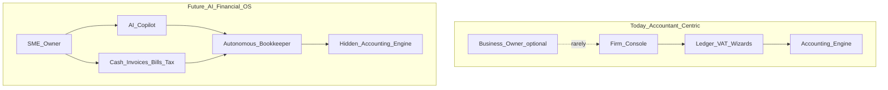
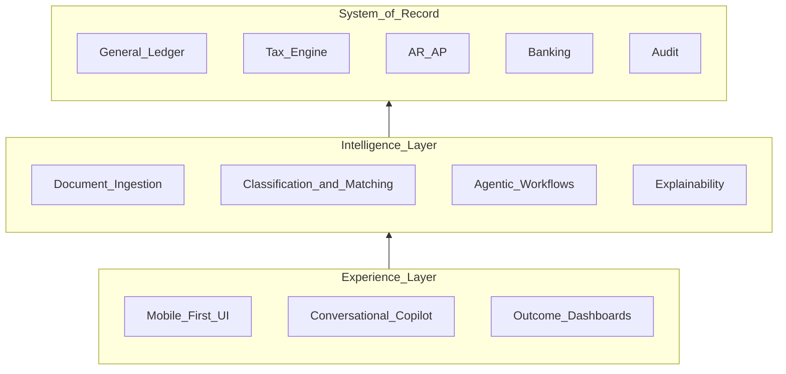
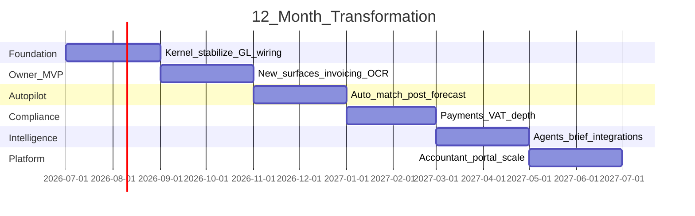

# AI Financial Operating System — Transformation Strategy

**Product:** SA Accountant Edition → AI-powered Financial OS for SME owners  
**Source of truth:** [Due Diligence Audit Report](./due-diligence-audit.md)  
**Date:** June 2026  
**Status:** Strategic planning document (no implementation commitments)

---

## Executive summary

The current codebase is a **well-architected practice accounting platform** built for accountants managing multiple client companies. The strategic opportunity is to **re-platform the experience** on top of the existing accounting kernel — not rewrite it — and target **South African small business owners** who have little or no accounting knowledge.

**Core thesis:** The owner should never see journals, ledgers, trial balances, debits, or credits. The accounting engine remains in the background. AI becomes the orchestration layer between messy real-world inputs (bank feeds, photos, PDFs) and deterministic financial logic.

**One-line vision:** *The AI Financial Operating System that runs your business finances while you run your business.*

---

## Module disposition

### 1. Remain largely unchanged (backend infrastructure)

Keep logic; hide accounting vocabulary from owners.

| Module | Rationale |
|--------|-----------|
| **Prisma schema / PostgreSQL** | 24-model foundation; GL, VAT, AR/AP, banking relationships suit a hidden engine |
| **NestJS API layer** | 58 endpoints across modular services — substrate for a new owner-facing API façade |
| **`assertCompanyAccess` + firm/company/membership** | Multi-tenant model works; repurpose or simplify for single-owner SMEs |
| **Audit service** | Compliance and trust; critical for AI-proposed actions |
| **Supabase integration path** | Auth + storage optional stack is production-viable |
| **Reports engine (JSON/XLSX pipeline)** | Keep export machinery; change what owners see |
| **Bank rules engine** | Deterministic fallback when AI confidence is low |

### 2. Improve (keep domain, change depth and UX contract)

| Module | What to improve |
|--------|-----------------|
| **Banking** | Feed automation, auto-match to invoices/bills; owners see money in/out, not reconciliation states |
| **Sales (AR/AP)** | Invoice/bill creation UI, payment links, reminders |
| **VAT** | Owner sees tax due / all clear; VAT 201 becomes background compliance |
| **Dashboard** | Cash runway, bills due, who owes you, tax health — not accountant KPIs |
| **Storage** | Expand to receipts, contracts, supplier invoices (AI ingestion) |
| **Auth** | Magic link, social login; accountant invite as secondary persona |
| **Security** | Enforce roles, server-side protection, remove tokens from URL query params |

### 3. Completely redesign (same data, new product surface)

| Module | Why redesign |
|--------|--------------|
| **Company Console** | Built for accountants with many clients; owners need one business home |
| **Ledger UI** | COA, journals, trial balance must leave owner navigation |
| **Ledger API contract** | Keep engine; expose transactions and categories, not debits/credits |
| **VAT UI** | SARS workflow for accountants; owners need “We’ll handle your VAT” |
| **Admin** | Placeholder today; becomes Settings + team + integrations |
| **Navigation / App shell** | Sidebar taxonomy is accountant-oriented |
| **Command palette** | Power-user pattern; replace with natural-language “Ask your finances” |
| **Onboarding** | No path for business type, bank connect, first invoice in minutes |

### 4. Remove (from owner-facing product)

Remove from owner UX — not necessarily delete backend tables.

| Element | Reason |
|---------|--------|
| **Firm console as primary entry** | Wrong mental model for SME owner |
| **Owner-visible GL pages** | `/ledger`, trial balance, chart of accounts |
| **Practice tasks & notes as primary** | Accountant workflow artifacts |
| **Multi-client compliance portfolio** | Accountant view |
| **“Mark reviewed / reconciled” banking UX** | Accounting jargon |
| **Redis in docker-compose** | Unused |
| **Decorative UI** | Notifications bell, fake sync badge, hardcoded chart fragments |
| **CLIENT_READONLY role (until built)** | Defined but unenforced |

### 5. Add (net-new capabilities)

| Module | Purpose |
|--------|---------|
| **AI Copilot (“Finance Brain”)** | Natural language Q&A, actions, plain-English explanations |
| **Autonomous Bookkeeper** | Background posting, categorization, matching, anomaly detection |
| **Cash Command Center** | Runway, inflows/outflows, forecasts — daily owner home |
| **Smart Invoicing & Collections** | Create, send, chase, get paid |
| **Bill Pay & Approvals** | Capture supplier bills, schedule payment |
| **Receipt & document capture** | Photo/PDF → structured transaction |
| **Tax Autopilot** | VAT/income tax readiness, deadlines, filing prep (SA-first) |
| **Integrations hub** | Bank feeds, PayFast/Ozow/Stripe, e-commerce |
| **Owner onboarding wizard** | Business type, bank connect, first invoice quickly |
| **Insights & alerts engine** | Proactive low-cash, unusual spend, overdue invoice alerts |
| **Mobile-first capture** | Receipt snap, approve payments on phone |
| **Accountant mode (optional)** | Secondary persona; current console becomes channel, not core product |

---

## Transformation model

**Today:** “Which client am I working on, and is their VAT period closed?”  
**Tomorrow:** “Can I pay my suppliers Friday, and am I on track for tax?”



**Principle:** Every owner action maps to a business outcome. Every accounting artifact is generated, verified, and stored by the Autonomous Bookkeeper.

| Owner says | System does (hidden) |
|------------|----------------------|
| “I got paid R8,500 from Acme” | Match to invoice → bank transaction → GL post |
| “Scan this supplier invoice” | OCR → bill → VAT → approval → payment schedule |
| “How much tax do I owe?” | Aggregate VAT periods → plain-English answer |
| “Can I afford to hire?” | Cash forecast + committed bills + tax reserve |

---

## A. Current architecture assessment

**What exists:** A practice accounting backend with a Sage-inspired accountant UI.

### Strengths (retain)

- Modern monorepo (Next.js 15, NestJS, Prisma, PostgreSQL)
- Coherent SA domain model (ZAR, bi-monthly VAT, VAT 201 fields)
- Double-entry engine with balance validation
- Consistent multi-tenant isolation (`assertCompanyAccess`)
- API ahead of UI — enables front-end rebuild without kernel rewrite
- Audit trail and optional Supabase path

### Structural gaps (for SME + AI)

- **Persona mismatch:** Navigation, copy, workflows assume an accountant
- **Siloed subsystems:** Invoices, bills, bank, and GL do not auto-integrate
- **No intelligence layer:** Rules-only categorization; no OCR, NLP, or agents
- **Broken owner loop:** Create invoice → get paid → pay supplier → stay compliant is incomplete in UI
- **Trust immature:** No tests, no migrations, roles not enforced
- **Accountant-grade reporting:** Not owner insights

### Verdict

Strong **accounting kernel**, weak **owner product**, absent **AI orchestration layer**. Re-platform the experience; do not discard the kernel.

---

## B. Future vision

**North star:** A South African SME owner opens one app each morning and sees:

1. **Cash** — what’s in the bank, what’s coming in, what’s going out
2. **Actions** — a short list needing one tap (approve bill, chase invoice, confirm spend)
3. **Confidence** — tax is handled, books are current, no surprises

**AI is not a chatbot bolt-on.** It is the orchestration layer between real-world inputs and the deterministic accounting engine.

### Three layers



---

## C. Recommended product positioning

**Category:** AI Financial Operating System (not “accounting software”)

**Positioning statement:**  
*For South African small business owners who don’t have time or appetite for accounting, [Product] is the AI-powered financial operating system that keeps cash, invoices, bills, and tax on autopilot — with an accountant-grade engine running silently underneath.*

### Differentiation vs Xero / QuickBooks / Sage

- Zero accounting vocabulary in primary UX
- AI-first orchestration, not retrofitted features
- SA-native: VAT, local banks, PayFast, SARS readiness
- Mobile capture as first-class
- Outcome-oriented value proposition

### Go-to-market (sequenced)

1. **Primary:** SME owners (product-led growth)
2. **Secondary (year 2):** Accountant channel — firm console becomes “Accountant Portal” for oversight

### Avoid positioning as

“Sage but prettier” or “accountant edition” — current naming and IA reinforce the wrong buyer.

---

## D. Recommended core modules (owner-facing)

| Module | Owner-facing name | Owner experience |
|--------|-------------------|------------------|
| **Home** | Today | Cash position, actions needed, AI summary |
| **Money** | Cash & Bank | Accounts; transactions in plain language |
| **Get Paid** | Invoices | Create, send, track, chase |
| **Pay** | Bills & Suppliers | Capture, approve, schedule payment |
| **Customers & Products** | People & what you sell | Simple directory |
| **Tax** | Tax & Compliance | Status, deadlines, prepared returns |
| **Insights** | Reports for humans | P&L story, cash flow — no trial balance |
| **Documents** | Receipts & files | Upload, search, link to transactions |
| **Settings** | Business & team | Profile, banks, integrations, invite accountant |

**Hidden from main nav:** Ledger, journals, COA editor, trial balance, VAT 201 field grid.

---

## E. Recommended AI modules

| AI module | Function | Inputs | Outputs |
|-----------|----------|--------|---------|
| **Finance Copilot** | NL Q&A + actions | Chat, voice (later) | Answers, drafts, approvals |
| **Document Intelligence** | OCR + extraction | Photos, PDFs, email | Bills, receipts, line items |
| **Transaction Classifier** | Categorize & match | Bank lines, history, rules | Category, VAT, confidence |
| **Autonomous Bookkeeper** | Post & reconcile | Classified events | GL entries, links, audit |
| **Collections Agent** | Chase payments | Overdue invoices | Reminder drafts |
| **Tax Copilot** | Compliance readiness | Transactions, calendar | Plain tax answers, filing pack |
| **Anomaly Guard** | Fraud & errors | Patterns | Alerts |
| **Forecast Engine** | Cash prediction | History, bills | Runway, scenarios |
| **Explainability Layer** | Trust | Any AI decision | “Because this matched Invoice #1042” |

### Architecture principles

- **AI proposes → owner confirms → engine commits → audit logs**
- High-confidence items may auto-apply with undo window
- LLM for language and document understanding
- Deterministic engine for tax math and double-entry
- Never post unbalanced journals without validation gate

---

## F. Recommended user experience

### Design rules (non-negotiable)

1. No debits, credits, journals, ledger, or trial balance in owner UI
2. Verbs not nouns: “Get paid”, “Pay a bill”, “Check tax”
3. Progressive disclosure: accountant view behind invite only
4. Confidence indicators: auto-matched, needs OK, unsure
5. Mobile-first capture: camera → done
6. Onboarding under 10 minutes: bank → first invoice → see cash

### Information architecture (replace current sidebar)

```
Today          → Home / actions / AI brief
Money          → Bank + cash flow
Get Paid       → Invoices + customers
Pay            → Bills + suppliers
Tax            → Compliance status
Insights       → Owner reports
Documents      → Files + receipts
Settings       → Profile, integrations, team
```

### Interaction model

Replace command palette (Ctrl+K) with **“Ask anything”** — conversational front on existing search and actions.

### Tone

Calm, confident, non-judgmental.  
*“You have 2 bills due this week”* — not *“Creditors overdue: 3”*.

---

## G. Recommended MVP (90 days)

**Goal:** Prove an SME owner can run daily finances without accounting knowledge.

### In scope

| Capability | Notes |
|------------|-------|
| Owner onboarding + single company | Not firm console |
| Bank connect or CSV import | Not all SA banks day one |
| AI categorization (rules + LLM assist) | Human confirm required |
| Create & send invoice (email/PDF) | |
| Bill capture via photo/PDF (basic OCR) | |
| Home: cash, actions, tax date | |
| Tax status: VAT estimate for period | Not eFiling |
| Copilot: ~10 canonical questions | Not open agent |
| Accountant invite (read-only export) | Not full portal |

### Out of scope (MVP)

- Firm console / multi-client as primary
- Full autonomous posting without review
- Payment gateway native execution
- SARS eFiling integration
- P&L / balance sheet for owners
- Payroll

### MVP user stories

1. Owner signs up, connects bank, sees plain-language transactions within 24h
2. Owner creates and sends an invoice in under 2 minutes
3. Owner photographs supplier invoice → draft bill → one-tap approve
4. Owner asks “How much money do I have?” and “What tax is coming?” — plain answers
5. Owner never sees a journal

### MVP success metrics

| Metric | Target |
|--------|--------|
| Time to first value | < 15 minutes |
| Auto-categorized transactions | > 70% |
| Weekly active owners | Growth week-on-week |
| Invoices sent per business / month | > 0 for active users |
| Support tickets mentioning debit/credit/ledger | ≈ 0 |

---

## H. Recommended 12-month roadmap

### Phase 0 — Foundation (Months 1–2)

*Stabilize kernel*

- Prisma migrations; test suite on GL, VAT, banking core
- Enforce auth server-side; fix role model
- Wire GL posting from invoices, bills, bank (background)
- Hide ledger from owner nav; rebrand shell copy
- Owner onboarding v0

### Phase 1 — Owner MVP (Months 3–4)

*First usable owner product*

- Home, Money, Get Paid, Pay surfaces
- Invoice create + send
- Document capture v1 (OCR)
- AI categorization with human confirm
- Tax status card (VAT estimate)
- Copilot v1 (canonical Q&A)

### Phase 2 — Autopilot (Months 5–6)

*Reduce owner effort*

- Auto-match payments to invoices
- Auto-post high-confidence transactions
- Collections reminders (email)
- Cash runway forecast
- Anomaly alerts
- Mobile-optimized capture

### Phase 3 — Compliance & payments (Months 7–8)

*Money movement + tax depth*

- PayFast / payment links on invoices
- Bill payment scheduling
- Full VAT 201 engine (all fields, tax codes)
- VAT filing prep export / accountant handoff
- PAYE module design (if employer segment confirmed)

### Phase 4 — Intelligence scale (Months 9–10)

*AI as the product*

- Agentic workflows (background month-end)
- Proactive weekly “Finance Brief”
- Industry templates (retail, services, e-commerce)
- Integration marketplace (Shopify, WooCommerce, bank APIs)

### Phase 5 — Platform & channel (Months 11–12)

*Expand TAM*

- Accountant Portal (repurposed firm console)
- Multi-user roles enforced
- Partner API
- Advanced insights (P&L narrative, benchmarking)
- Enterprise readiness: SOC2 path, SLA, backups



---

## Summary matrix

| Current module | Verdict | Future role |
|----------------|---------|-------------|
| Firm / Company console | Redesign | Single-business Home; firm view → accountant channel |
| Dashboard | Improve | “Today” — cash, actions, AI brief |
| Banking | Improve | “Money” — plain-language transactions |
| Ledger (UI) | Remove (owner) | Hidden engine only |
| Ledger (API) | Improve | Posting automation behind scenes |
| VAT (UI) | Redesign | “Tax” status + autopilot |
| VAT (engine) | Improve | Full SA compliance |
| Sales / AR/AP | Improve | “Get Paid” / “Pay” |
| Items | Improve | Products & services (not full inventory) |
| Reports | Redesign | Owner insights; accountant exports secondary |
| Notes / Tasks | Demote | Internal or AI-generated reminders |
| Admin | Redesign | Settings + team |
| Auth | Improve | Owner-first signup |
| Storage | Improve | Document intelligence hub |
| Audit | Keep | AI action logging |
| AI | **Add** | Core product layer |
| Payroll | **Add (later)** | Phase 3+ if employer segment |
| Inventory | **Add (later)** | If retail vertical prioritized |

---

## Decision log (for future reference)

| Decision | Choice | Rationale |
|----------|--------|-----------|
| Rewrite vs re-platform | Re-platform | Kernel is sound per audit |
| Primary persona | SME owner | Larger PLG market; accountant as channel |
| AI role | Orchestration layer | Not cosmetic chatbot |
| GL visibility | Hidden from owners | Core product principle |
| MVP geography | South Africa first | Existing VAT/domain fit |
| Accountant product | Phase 5 channel | Preserve existing work as portal |

---

## Related documents

- [Due Diligence Audit Report](./due-diligence-audit.md) — factual inventory of current state
- [Screen Route Map](./screen-route-map.md) — Sage parity reference (legacy IA)
- [Supabase Setup](./supabase-setup.md) — infrastructure guide

---

*This document describes strategic intent. It does not supersede the audit’s factual claims about current-state gaps. Implementation planning should trace each initiative back to audit findings.*
