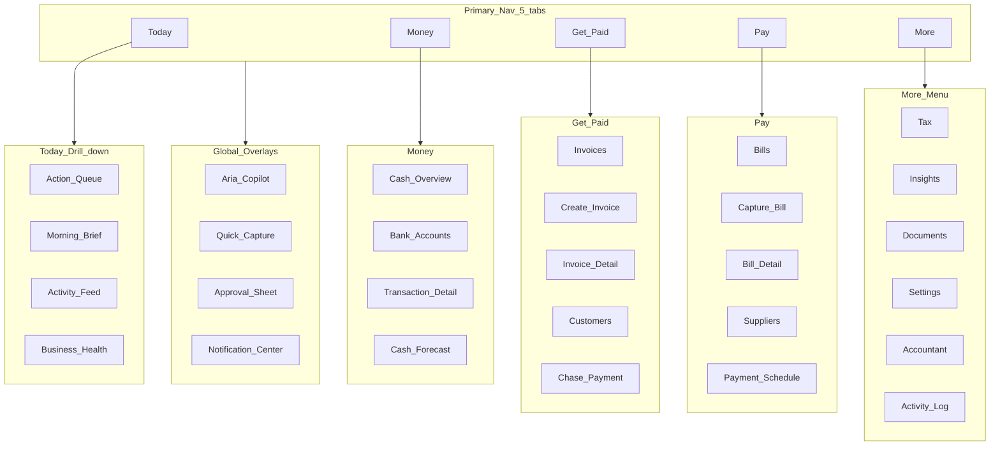
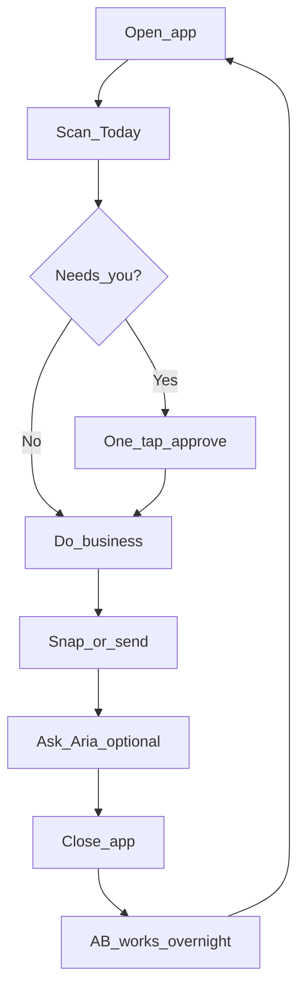
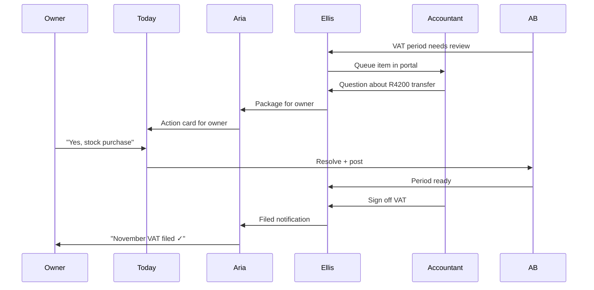

# AI Financial Operating System — Complete UX Architecture

**Sources:** [Due Diligence Audit Report](./due-diligence-audit.md) · [AI Financial OS Strategy](./ai-financial-os-strategy.md) · [Autonomous Bookkeeper Blueprint](./autonomous-bookkeeper-blueprint.md) · [AI Workforce Blueprint](./ai-workforce-blueprint.md)  
**Audience:** Product, design, and strategy — no implementation  
**Date:** June 2026  
**Status:** Product experience blueprint (no implementation commitments)

**North star:** The owner runs their business. Finance runs itself.

---

## Design philosophy

### What this product is not

Not accounting software. Not a dashboard of KPIs. Not a chatbot bolted onto Xero.

### What it feels like

| Reference | What we borrow |
|-----------|----------------|
| **Apple** | One calm home screen; progressive disclosure; delight in small moments ("Done ✓") |
| **OpenAI** | Aria as trusted conversational layer — always available, never overwhelming |
| **Notion** | Clean surfaces, contextual depth on tap, no chrome for chrome's sake |
| **Stripe** | Money feels precise, trustworthy, and legible |
| **Xero** | Professional-grade engine — entirely hidden from the owner |

### Behavioural principles

1. **Reduce cognitive load** — One question at a time; never show 12 reconciliation items when 1 decision resolves them.
2. **Outcome over process** — "Get paid" not "Create tax invoice"; "Handled ✓" not "Posted to GL".
3. **Trust through transparency** — Every auto-action has a one-sentence "why"; every number is AB-confirmed.
4. **Proportionate interruption** — Urgent cash/tax/fraud breaks through; everything else batches into Today.
5. **Learn from behaviour** — Approvals teach the system; owners feel smarter, not managed.
6. **Accountant as safety net** — Owner sees confidence, not complexity; professional depth is one invite away.

### Vocabulary contract (owner channel)

| Never say | Always say |
|-----------|------------|
| Debit / credit | Money in / money out |
| Journal / posting | Recorded / handled |
| Reconcile | Matched |
| Debtors / creditors | They owe you / you owe them |
| GL account | Category (Rent, Stock, etc.) |
| Trial balance | Your books are up to date |
| VAT field 4 | VAT on sales this period |

---

## 1. Complete screen architecture

### Information architecture (owner product)



### Screen inventory (owner-facing)

| # | Screen | Purpose | Entry |
|---|--------|---------|-------|
| **Core** |
| 1 | **Today** | Command center — health, actions, brief, insights | Default on open |
| 2 | **Money** | Cash position, accounts, transactions | Tab |
| 3 | **Get Paid** | Invoices, customers, collections | Tab |
| 4 | **Pay** | Bills, suppliers, approvals | Tab |
| 5 | **More** | Hub for Tax, Insights, Documents, Settings | Tab |
| **Today children** |
| 6 | Action Queue | Full prioritized list of decisions | "N things need you" |
| 7 | Morning Brief | Aria's daily narrative summary | Tap brief card |
| 8 | Activity Feed | Chronological "what happened" | Scroll Today |
| 9 | Business Health | Books/tax/cash status at a glance | Health strip |
| **Money children** |
| 10 | Cash Overview | Total cash + runway + in/out this week | Money home |
| 11 | Bank Account | Per-account balance and txns | Account card |
| 12 | Transaction Detail | Plain-language txn + match + explain | Tap txn |
| 13 | Cash Forecast | 30/60/90-day outlook (Cass) | "See ahead" |
| **Get Paid children** |
| 14 | Invoice List | Waiting / overdue / paid | Get Paid home |
| 15 | Create Invoice | Fast invoice flow | FAB / Aria |
| 16 | Invoice Detail | Status, send, chase, payment | Tap invoice |
| 17 | Customer Profile | Contact, history, balance owed | Tap customer |
| 18 | Chase Payment | Reminder draft + send | Overdue action |
| **Pay children** |
| 19 | Bill List | To approve / scheduled / paid | Pay home |
| 20 | Capture Bill | Camera / upload / email forward | FAB |
| 21 | Bill Detail | Approve, schedule, pay status | Tap bill |
| 22 | Supplier Profile | History, recurring patterns | Tap supplier |
| 23 | Payment Schedule | Upcoming outflows calendar | Pay sub-nav |
| **More children** |
| 24 | Tax | VAT status, deadlines, readiness | More |
| 25 | Tax Period Detail | Period summary (plain English) | Tap period |
| 26 | Insights | P&L story, trends (no TB) | More |
| 27 | Insight Detail | Drill into metric | Tap card |
| 28 | Documents | Receipts, files, search | More |
| 29 | Document Detail | Preview + linked transactions | Tap doc |
| 30 | Settings | Business profile, banks, team | More |
| 31 | Integrations | Bank feeds, payment links | Settings |
| 32 | Team & Roles | Invite users, accountant | Settings |
| 33 | Accountant Hub | Status, messages, handoffs | More / Settings |
| 34 | Activity Log | Plain-language audit trail | Settings |
| **Global overlays** |
| 35 | **Aria** | Copilot — ask, act, approve | Persistent entry |
| 36 | Quick Capture | Camera-first universal ingest | FAB |
| 37 | Approval Sheet | Full-screen one-tap decision | Action card |
| 38 | Notification Center | Grouped alerts | Bell / Today |
| 39 | Onboarding Wizard | First-run setup | First launch |
| 40 | Empty States | Guided first actions per module | Zero data |

### Screen inventory (accountant-only — separate app shell)

| # | Screen | Purpose |
|---|--------|---------|
| A1 | Practice Console | Multi-client portfolio |
| A2 | Client Workspace | Per-business professional view |
| A3 | Review Queue | AB escalations, quarantine |
| A4 | General Ledger | Journals, COA, trial balance |
| A5 | VAT 201 Workspace | Full SARS field grid |
| A6 | Reconciliation Desk | Technical bank reconciliation |
| A7 | Period Close | Lock, adjust, sign-off |
| A8 | Adjustments | Manual journals, reclassifications |
| A9 | Audit Trail (technical) | Decision records with GL refs |
| A10 | Export Center | TB, GL, VAT packs |

---

## 2. Complete navigation structure

### Owner navigation model

**Primary:** 5-tab bottom bar (mobile) / left rail (desktop) — never more than 5 top-level destinations.

```
[ Today ]  [ Money ]  [ + ]  [ Get Paid ]  [ Pay ]  [ More ]
```

The centre **+** is not a tab — it opens **Quick Capture** (camera, invoice, bill, ask Aria).

**Secondary:** Contextual headers inside each tab — no deep flyout menus.

**Tertiary:** More menu — Tax, Insights, Documents, Settings, Accountant.

**Global:** Aria — always one tap away (floating pill on mobile, sidebar panel on desktop).

### Navigation rules

| Rule | Rationale |
|------|-----------|
| Today is always one tap from anywhere | Command center |
| No "Accounting" section in owner nav | Wrong mental model |
| Back always returns to sensible parent | No maze |
| Deep links from notifications land on decision, not list | Reduce friction |
| Accountant mode = separate shell, separate URL | `/portal` not `/ledger` in owner app |
| Search replaced by "Ask Aria" | Conversational > command palette |

### Desktop vs mobile nav

| Element | Mobile | Desktop |
|---------|--------|---------|
| Primary nav | Bottom tab bar | Left sidebar (icons + labels) |
| Aria | Bottom sheet / full screen | Right docked panel (resizable) |
| Quick Capture | Centre FAB | Top bar "+ Capture" button |
| Approvals | Full-screen sheet | Inline card + side panel |
| More | Tab → list | Sidebar section below primary |

---

## 3. Complete mobile experience

Mobile is the **primary** surface — designed for owners on the move.

### Mobile-first patterns

| Pattern | Use |
|---------|-----|
| **Thumb-zone actions** | Approve / decline at bottom of screen |
| **Swipe actions** | Swipe invoice → "Send reminder"; swipe bill → "Approve" |
| **Camera-first capture** | Open app → + → snap receipt in 2 taps |
| **Haptic confirmation** | Approve → subtle haptic + "Done ✓" |
| **Push notifications** | Only: cash low, approval needed, payment received, tax deadline, fraud hold |
| **Offline capture** | Queue photos; sync when online |
| **Biometric approve** | High-value approvals (> R5k) → Face ID confirm |

### Mobile screen priorities

1. **Today** — scrollable feed, not dashboard grid
2. **One-thumb approvals** — full-width cards, max 2 choices
3. **Aria voice** (later) — "How much cash do I have?" hands-free
4. **Invoice send** — share sheet native (WhatsApp, email)
5. **Payment received** — celebration moment (subtle, not gamified)

### Mobile layout: Today (default)

```
┌─────────────────────────────┐
│ Good morning, Thabo    [🔔] │
│ Acme Trading                │
├─────────────────────────────┤
│ ● All good  ·  R 142,300    │  ← Health strip
│   cash  ·  18 days runway   │
├─────────────────────────────┤
│ 💬 Aria brief               │
│ "Overnight: 12 handled,     │
│  1 needs you, R8.5k in."    │
├─────────────────────────────┤
│ ⚡ 1 needs you              │  ← Priority actions
│ ┌─────────────────────────┐ │
│ │ Was this R4,200 payment │ │
│ │ to XYZ Supplies stock?  │ │
│ │ [Yes, stock] [Not sure] │ │
│ └─────────────────────────┘ │
├─────────────────────────────┤
│ Coming up                   │
│ · Rent R15k due Fri         │
│ · VAT due in 9 days         │
├─────────────────────────────┤
│ Handled while you slept ✓   │  ← Collapsed auto-actions
│ · 12 transactions sorted    │
├─────────────────────────────┤
│ Insight                     │
│ "Collections up 12% — nice" │
├─────────────────────────────┤
│ Activity                    │
│ · R8,500 from Acme — paid   │
│ · Bill from Landlord logged │
└─────────────────────────────┘
│ Today │ Money │ + │ Paid │ Pay │ More │
└─────────────────────────────┘
     [ Ask Aria — floating pill ]
```

---

## 4. Complete desktop experience

Desktop is for **planning, review, and power workflows** — not a denser accounting UI.

### Desktop layout

```
┌──────────┬────────────────────────────────┬─────────────┐
│ Sidebar  │         Main content           │    Aria     │
│          │                                │   (dock)    │
│ Today    │                                │             │
│ Money    │                                │  "Ask me    │
│ Get Paid │                                │   anything" │
│ Pay      │                                │             │
│ ─────    │                                │             │
│ Tax      │                                │             │
│ Insights │                                │             │
│ Docs     │                                │             │
│ Settings │                                │             │
└──────────┴────────────────────────────────┴─────────────┘
```

### Desktop enhancements (not more accounting)

| Enhancement | Purpose |
|-------------|---------|
| Multi-column Today | Actions left, activity centre, insights right |
| Split views | Invoice list + detail side-by-side |
| Keyboard shortcuts | `N` new invoice, `A` open Aria, `/` focus ask |
| Drag-drop documents | Bulk upload to Documents |
| Wider forecast charts | Cass scenarios with sliders |
| Print-friendly invoices | PDF preview inline |

### Desktop is not

- A spreadsheet-style ledger
- A multi-panel accountant workstation (that's the portal)
- A place where more columns = more professionalism

---

## 5. First-time onboarding experience

**Goal:** Value in under 10 minutes. Owner sees cash or sends first invoice before leaving.

### Onboarding flow (7 steps)


| Step | Screen | Content | Behavioural goal |
|------|--------|---------|------------------|
| 1 | **Welcome** | "Run your business. We'll handle the money." | Set expectation: not accounting |
| 2 | **Business basics** | Name, industry, VAT registered? (yes/no/not sure) | Personalize language and tax path |
| 3 | **What you do** | Services / products / both — simple tiles | Tune categories and insights |
| 4 | **Connect bank** | Link account or upload CSV; skip allowed | First data ingestion |
| 5 | **Meet Aria** | 30-second intro: ask, snap, approve | Establish trust relationship |
| 6 | **First win** | Branch: create invoice OR snap receipt OR wait for bank | Tangible outcome |
| 7 | **Today landing** | Populated Today with "Getting started" cards | Habit loop begins |

### Onboarding copy principles

- **No jargon** — "Are you registered for VAT?" not "Select tax scheme"
- **Escape hatches** — "Not sure? We'll figure it out together"
- **Progress, not forms** — 7 steps, one question each, progress dots
- **Accountant optional** — "Have an accountant? Invite them anytime" — never required

### Post-onboarding (days 1–7)

| Day | Proactive nudge (via Today / push) |
|-----|-----------------------------------|
| 1 | "Snap your first receipt" |
| 2 | "Here's what came in from your bank" |
| 3 | "Create an invoice for your biggest customer?" |
| 4 | "You have R X — here's what's coming up" |
| 7 | "Your first week — here's the summary" (Aria brief) |

---

## 6. Daily workflow experience

The owner's day is a **loop**, not a checklist of accounting tasks.



### Daily moments

| Moment | Owner action | System response |
|--------|--------------|-----------------|
| **Morning open** | Glance Today | Health strip + brief + priority actions |
| **Commute** | Voice/text Aria | Cash, tax, who owes me |
| **Supplier delivery** | Snap receipt | Dex drafts bill → approval card |
| **Customer pays** | Nothing | Remi matches → "R8,500 from Acme ✓" |
| **Lunch check-in** | Swipe activity | Confidence everything's handled |
| **Afternoon sale** | Create + send invoice | 2-minute flow |
| **Evening** | Approve tomorrow's bills | Payne schedule confirmation |
| **Close** | Optional peek at runway | Cass "you're fine until the 15th" |

### Daily notification policy

| Send push | Don't send push |
|-----------|-----------------|
| Approval needed (material) | Every auto-categorized txn |
| Payment received (large) | Routine handling |
| Cash runway < 14 days | "12 items handled" |
| Tax deadline < 7 days | Marketing |
| Fraud / duplicate hold | Accountant internal queue |

---

## 7. Month-end experience

Month-end is **invisible automation** for the owner — not a "close the books" ritual.

### Owner sees (month-end)

| Element | Presentation |
|---------|--------------|
| **Week before** | Today card: "Month-end coming — 2 items need you before we wrap up" |
| **3 days before** | Tax card: "VAT period ending — you're on track" or "1 thing to confirm" |
| **Last day** | Aria brief: "November's wrapped. Your accountant is reviewing if needed." |
| **After close** | Insight: "November in plain English — revenue up, costs steady" |

### Owner does NOT do

- Run trial balance
- Review reconciliation report
- "Close period" button
- Journal adjustments

### Behind the scenes (owner-invisible)

AB → continuous close → Vera monitors → Tessa packages VAT → Ellis queues accountant → owner gets outcome notification.

### Month-end Today card example

```
┌─────────────────────────────────────┐
│ 📅 Wrapping up November             │
│                                     │
│ ✓ 47 transactions handled           │
│ ✓ 3 invoices paid                   │
│ · 1 receipt still needed (R890)    │
│                                     │
│ [Snap receipt]  [Ask Aria]          │
│                                     │
│ Your accountant will review VAT     │
│ by 5 Dec. You don't need to do     │
│ anything else.                      │
└─────────────────────────────────────┘
```

---

## 8. Tax preparation experience

Tax is a **status and confidence** surface — not a SARS wizard.

### Tax home screen

```
┌─────────────────────────────────────┐
│ Tax & Compliance                    │
├─────────────────────────────────────┤
│ ● On track                          │
│                                     │
│ Estimated VAT this period           │
│ R 8,200 payable                     │
│ Due 25 January · 9 days away        │
│                                     │
│ [━━━━━━━●━━]  Ready                 │
│  What's left: nothing — you're good │
├─────────────────────────────────────┤
│ This period (plain English)         │
│ · VAT on sales:      R 24,100       │
│ · VAT on purchases:  R 15,900       │
│ · Net VAT:           R  8,200       │
├─────────────────────────────────────┤
│ Upcoming                            │
│ · VAT return — 25 Jan               │
│ · Provisional tax — 28 Feb (later)  │
├─────────────────────────────────────┤
│ Your accountant                     │
│ ● Reviewing November VAT            │
│ [Message accountant]                │
└─────────────────────────────────────┘
```

### Tax journey stages

| Stage | Owner experience | Agent |
|-------|------------------|-------|
| **Continuous** | Tax card on Today always current | Tessa + AB |
| **2 weeks before** | "VAT due soon — all clear" or action list | Vera |
| **1 week before** | Readiness checklist (plain English) | Tessa |
| **Accountant review** | "Your accountant is preparing your return" | Ellis |
| **Ready to file** | "Your VAT return is ready — your accountant will file" | Ellis → owner via Aria |
| **Filed** | "November VAT filed ✓" | Notification |

### Tax questions (Aria)

- "How much tax do I owe?" → AB-confirmed estimate
- "Am I OK for VAT?" → readiness status
- "What happens if I'm late?" → calm factual answer + Vera escalation if needed

### Never on owner Tax screen

- VAT 201 field grid
- Input/output tax control accounts
- "Mark period reviewed"
- Journal adjustments for VAT

---

## 9. Accountant collaboration experience

### Owner side: Accountant Hub

```
┌─────────────────────────────────────┐
│ Your accountant                     │
├─────────────────────────────────────┤
│ Thandi M. · CA(SA)                  │
│ ● Reviewing your November VAT       │
│                                     │
│ Last activity: 2 hours ago          │
│ "Almost done — 1 question on        │
│  the R4,200 transfer"               │
├─────────────────────────────────────┤
│ [Message]  [Share document]         │
├─────────────────────────────────────┤
│ What they can see                   │
│ · All transactions (read)           │
│ · VAT returns (prepare & file)      │
│ · Adjustments (with your OK)          │
├─────────────────────────────────────┤
│ [Invite accountant]  [Change access]│
└─────────────────────────────────────┘
```

### Owner ↔ accountant communication rules

| Owner sees | Owner never sees |
|------------|------------------|
| "Your accountant approved your VAT return" | Journal entries |
| "Thandi asked about the R4,200 payment" | Trial balance |
| Plain summary after adjustment | "Dr/Cr rent reclassification" |
| Status: reviewing / done / needs you | VAT 201 field editor |

### Accountant portal (separate product surface)

- **Entry:** `portal.product.co.za` — firm login, client list
- **Mental model:** "AI-prepared books awaiting my sign-off"
- **Primary queue:** Ellis review items (quarantine, VAT close, adjustments)
- **Tools:** GL, TB, VAT 201, technical reconciliation, period lock
- **Collaboration:** Ask owner question → appears as Today action card for owner
- **Sign-off flow:** Accountant approves → owner notified in plain English

### Collaboration journey



---

## The Today screen — command center

Today is the **CEO dashboard for a business owner who is not a CEO of finance**. Everything important flows here; everything else is a tap away.

### Design intent

- **First screen, every session**
- **Answers three questions in 3 seconds:** Am I OK? What needs me? What happened?
- **Single scroll** — not a widget dashboard
- **Actions float to top** — insights and activity below

### Screen anatomy (top to bottom)

#### 1. Header zone

- Greeting (time-aware): "Good morning, Thabo"
- Business name (single company; no firm console)
- Notification bell (badge = actionable only)

#### 2. Health strip (always visible)

One line, traffic-light semantics:

| State | Display |
|-------|---------|
| **All good** | Green dot · R 142,300 cash · 18 days runway |
| **Needs you** | Amber dot · 2 decisions waiting |
| **Attention** | Red dot · Cash low / tax overdue / fraud hold |

Tap → Business Health detail (books current, tax status, bank sync).

#### 3. Aria morning brief

- 2–4 sentences, conversational
- Generated overnight from Nova + AB state
- Example: *"While you slept: 12 transactions sorted, R8,500 came in from Acme, and 1 payment needs your OK. Cash is healthy — you're fine until the 15th."*
- Tap → expand full brief; "Ask follow-up" opens Aria

#### 4. Priority actions (the heart)

- **Max 3 visible**; "See all (5)" → Action Queue
- Sorted by Nova priority algorithm (below)
- Each card = **one decision**, not a task list

**Card anatomy:**

```
┌─────────────────────────────────────┐
│ 💳 Payment · Needs you              │
│ Was this R4,200 to XYZ Supplies     │
│ for stock?                          │
│                                     │
│ Aria: "Looks like your usual        │
│ supplier — 94% confident"            │
│                                     │
│ [Yes, stock]  [No, something else]  │
└─────────────────────────────────────┘
```

#### 5. Coming up (proactive horizon)

- Next 7 days: bills due, tax dates, expected payments in
- Sourced from Payne + Vera + Remi + Cass
- Calm tone: "Rent R15,000 due Friday" — not "Creditors ageing"

#### 6. Handled automatically (collapsed by default)

- Summary line: "12 handled while you slept ✓"
- Expand → list with one-line explanations
- Each item tappable → explainability sheet
- 24h undo available on auto-committed items

#### 7. Insight card (one per day)

- Cass / Remi / Tessa narrative insight
- Examples: "Collections up 12% this month", "Unusual spend in Travel — tap to review"
- Never alarmist; curiosity not anxiety

#### 8. Activity feed (infinite scroll)

- Chronological, plain language
- Icons by type: money in, money out, invoice, bill, tax, system
- Tap any item → detail + "Why?" explanation

### Actions available on Today

| Action | How |
|--------|-----|
| Approve / decline | Inline on action cards |
| Quick capture | Centre + FAB |
| Ask Aria | Floating pill / brief follow-up |
| Send invoice | Shortcut chip if overdue AR |
| Snap receipt | Shortcut if Dex flagged missing doc |
| View cash | Tap health strip |
| See all actions | "N things need you" |
| Undo auto-action | Handled section → item → Undo |

### Notifications on Today

| Type | Where shown |
|------|-------------|
| Push (overnight) | Lands as action card or activity item |
| In-app bell | Grouped: Needs you / Updates / Insights |
| Critical | Breaks into health strip (red) |
| Accountant | "Thandi left a message" card |

**Not shown on Today:** spammy "sync complete", every bank line import, internal AB logs.

### How Aria appears on Today

| Mode | Behaviour |
|------|-----------|
| **Brief** | Embedded card — proactive, not chatty |
| **Floating pill** | "Ask Aria" — persistent, bottom centre (mobile) |
| **Contextual** | On action cards — one-line confidence/explanation |
| **On tap** | Opens copilot with Today context pre-loaded |
| **Never** | Multiple agent avatars; Nova/Dex/Payne don't speak directly |

Aria personality: calm, competent, warm — like a brilliant finance manager who respects your time.

### How approvals work on Today

1. **Nova prioritizes** → surfaces top 3 on Today
2. **Card = one question** — binary or ternary choice max
3. **Tap choice** → haptic + "Done ✓" + card animates away
4. **"Not sure"** → Aria opens with context; never dumps to a form
5. **"Something else"** → guided disambiguation (pick customer, pick category in plain English)
6. **High value (> R5k)** → biometric confirm on mobile
7. **Batch approve** (later): "Approve 3 similar rent payments?" — explicit opt-in

### How AI insights appear

| Insight type | Source | Placement |
|--------------|--------|-----------|
| Daily narrative | Aria + Nova | Brief card |
| Cash runway | Cass | Health strip + insight card |
| Collections trend | Remi | Insight card |
| Tax readiness | Tessa | Coming up + Tax tab |
| Anomaly | Scout | Priority action (never buried) |
| Weekly summary | Brief agent (later) | Monday Today takeover |

Insights use **ranges** when uncertain: "About R8,000–R8,400 VAT payable".

### Task prioritization algorithm (Nova → Today)

| Priority | Type | Example |
|----------|------|---------|
| **P0** | Blocker | Fraud hold, duplicate payment, bank feed down |
| **P1** | Time-sensitive | Tax deadline < 3 days, cash < 7 days runway |
| **P2** | Material approval | Bill > R5k, unknown counterparty |
| **P3** | Standard approval | Categorization, match confirm |
| **P4** | Informational | Payment received, handled automatically |
| **P5** | Insight | Trends, tips |

**Rules:**

- Max 3 P0–P2 on Today at once (avoid panic)
- P3 can batch ("3 quick confirmations")
- P4/P5 never push notify unless owner opts in
- Accountant-blocked items show "With your accountant" — not owner queue

---

## A. Every major screen (summary specs)

| Screen | Hero element | Primary CTA | Empty state |
|--------|--------------|-------------|-------------|
| **Today** | Health strip + actions | Approve top card | "Connect bank or send first invoice" |
| **Money** | Total cash + runway | View forecast | "Link your bank" |
| **Cash Overview** | Big number + trend sparkline | See transactions | — |
| **Transaction Detail** | Amount + counterparty + plain label | "Why?" explain | — |
| **Get Paid** | Outstanding total + overdue count | Create invoice | "Invoice your first customer" |
| **Create Invoice** | Customer + amount + line items | Send | — |
| **Invoice Detail** | Status badge + amount | Send / Chase | — |
| **Pay** | Due this week total | Capture bill | "Snap your first supplier invoice" |
| **Capture Bill** | Camera viewfinder | Capture | — |
| **Bill Detail** | Amount + supplier + status | Approve | — |
| **Tax** | On-track status + estimate | Ask Aria | "We'll track VAT once you connect bank" |
| **Insights** | Month story headline | Drill down | "Check back after a week of activity" |
| **Documents** | Recent uploads grid | Capture | "Snap a receipt to get started" |
| **Settings** | Business profile | Connect integration | — |
| **Aria** | Conversation + suggested prompts | Type / speak | "Try: How much cash do I have?" |
| **Approval Sheet** | Full-screen decision | Primary action bottom | — |
| **Accountant Hub** | Accountant status | Message | "Invite your accountant" |

---

## B. Every major user journey

### Journey 1: Get paid

`Today → Get Paid → Create Invoice → Send → [customer pays] → Today activity "R8,500 from Acme ✓"`

### Journey 2: Pay a supplier

`+ Capture → snap bill → Today approval card → Approve → Pay tab "Scheduled" → [bank pays] → "Paid ✓"`

### Journey 3: Morning check-in

`Open → Today health strip → read brief → approve 1 card → close (90 seconds)`

### Journey 4: "Can I afford it?"

`Aria → "Can I afford R20k equipment?" → Cass scenario → plain answer with runway impact`

### Journey 5: Chase overdue invoice

`Today "Acme overdue 14 days" → Chase → Remi draft reminder → owner approves send`

### Journey 6: Tax anxiety

`Owner worried → Tax tab → on-track status → Aria "Am I OK?" → Tessa narrative → calm`

### Journey 7: Month-end (owner)

`Today wrap-up card → confirm 1 missing receipt → "Your accountant is on it" → done`

### Journey 8: Accountant question

`Accountant asks via Ellis → Today action card → owner answers → accountant continues → owner notified "VAT filed ✓"`

### Journey 9: Fraud / anomaly

`Scout flags duplicate → P0 Today card → owner confirms or blocks → Scout resolves`

### Journey 10: First week onboarding

`Welcome → bank → first invoice → Today populated → day 7 week summary`

### Journey 11: Undo mistake

`Handled section → tap auto-categorized item → "This wasn't rent" → AB reverses → re-queues`

### Journey 12: Invite accountant

`Settings → Team → Invite → accountant accepts portal → owner sees Hub status`

---

## C. Owner day: morning to night

| Time | Context | Screen | Emotion target |
|------|---------|--------|----------------|
| **07:30** | Wake, check phone | Today | Relief — "only 1 thing needs me" |
| **07:32** | Approve stock payment | Action card | Competence — one tap, done |
| **08:15** | Coffee, think about cash | Aria | Confidence — "R142k, fine till the 15th" |
| **10:00** | Delivery arrives | + Capture | Ease — snap, walk away |
| **10:02** | Back to work | Today | Trust — "Bill from XYZ — approve?" |
| **12:30** | Customer calls about invoice | Get Paid → send | Professional — invoice in 2 min |
| **14:00** | Payment notification | Push → Today | Delight — "R8,500 from Acme ✓" |
| **16:00** | Plan Friday rent | Pay → schedule | Control — "R15k Friday — looks good" |
| **17:30** | Quick sanity check | Money forecast | Calm — runway chart |
| **19:00** | Accountant message | Accountant Hub | Supported — not alone |
| **21:00** | Optional peek | Today activity | Closure — "all handled" |

**Emotional arc:** anxiety → relief → confidence → closure. Never confusion, never guilt about "falling behind on books".

---

## D. Screens that must never expose accounting terminology

| Screen | Forbidden terms |
|--------|-----------------|
| Today | journal, debit, credit, reconcile, post, GL, trial balance |
| Money | reconciliation status, NEW/REVIEWED, control account |
| Get Paid | debtors, AR, tax invoice (use "invoice"), accrual |
| Pay | creditors, AP, liability account |
| Tax | VAT 201, field 4/10, input/output control, period lock |
| Insights | P&L (use "profit story"), balance sheet, TB |
| Documents | — (safe) |
| Settings | chart of accounts, fiscal year (use "financial year") |
| Aria | all accounting vocabulary — hard guardrail |
| Onboarding | everything |
| Approval cards | GL account codes, VAT codes (use "standard VAT" / "no VAT") |
| Activity log | posting refs, journal IDs |
| Notifications | all |

**Allowed plain terms:** cash, invoice, bill, receipt, VAT (as "tax"), customer, supplier, paid, overdue, category names (Rent, Stock, etc.).

---

## E. Accountant-only screens

| Screen | Why owner must never see |
|--------|---------------------------|
| Practice / Firm Console | Multi-client accountant workflow |
| Client portfolio dashboard | Wrong persona |
| General Ledger | Core product principle |
| Chart of Accounts editor | Accounting knowledge required |
| Journal entry form | Debit/credit |
| Trial Balance | Accounting artifact |
| VAT 201 field grid | SARS technical form |
| Bank reconciliation desk | Technical matching UI |
| Period lock / close | Professional judgment |
| Manual adjustments | Journal creation |
| Technical audit trail (with GL refs) | Implementation detail |
| Opening balances migration | One-time professional task |
| Quarantine release (technical) | AB internals |
| Export: TB, GL detail, audit pack | Accountant deliverables |

**Owner gets:** outcomes ("VAT filed"), questions ("Was this stock?"), and plain activity — never the engine room.

---

## Experience quality bar

Before any screen ships, it must pass:

1. **The Thabo test** — Would a SA salon owner understand every word?
2. **The 3-second test** — Does Today answer OK / need me / what happened?
3. **The one-tap test** — Can the most common approval be done in one tap?
4. **The anxiety test** — Does this screen create or reduce financial stress?
5. **The accountant test** — Is professional depth available without polluting owner UI?

---

## Summary

This document defines the complete product experience for the AI Financial Operating System — designed so the owner runs their business, and the Autonomous Bookkeeper, Nova, Aria, and the specialist workforce run the finance.

| Layer | Document |
|-------|----------|
| Current state | [Due Diligence Audit](./due-diligence-audit.md) |
| Strategy | [AI Financial OS Strategy](./ai-financial-os-strategy.md) |
| Execution engine | [Autonomous Bookkeeper Blueprint](./autonomous-bookkeeper-blueprint.md) |
| Virtual department | [AI Workforce Blueprint](./ai-workforce-blueprint.md) |
| **Owner experience** | **This document** |

---

*Product experience and user behaviour only. No implementation guidance. Aligns with prior strategy, AB, and workforce blueprint documents.*
