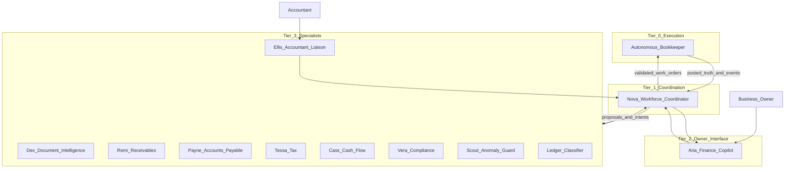
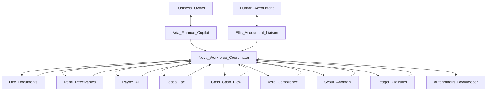
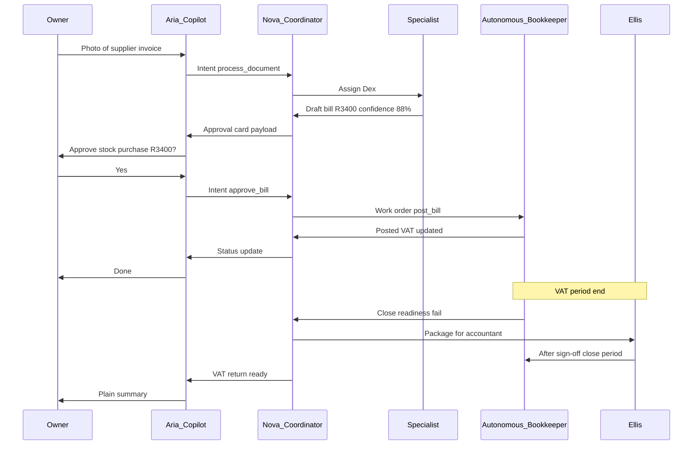

# AI Workforce — Virtual Finance Department Blueprint

**Sources:** [Due Diligence Audit Report](./due-diligence-audit.md) · [AI Financial OS Strategy](./ai-financial-os-strategy.md) · [Autonomous Bookkeeper Blueprint](./autonomous-bookkeeper-blueprint.md)  
**Role:** Virtual finance department operating inside the AI Financial Operating System  
**Premise:** The Autonomous Bookkeeper (AB) exists as the **execution engine and system of record**  
**Date:** June 2026  
**Status:** Operational design blueprint (business behaviour only — no implementation)

---

## Executive summary

The AI Workforce is the **virtual finance department** that works around the Autonomous Bookkeeper — sensing, advising, chasing, explaining, and escalating — so an SME owner never needs accounting knowledge.

**Three-tier structure:**

| Tier | Agent | Role |
|------|-------|------|
| **0** | Autonomous Bookkeeper | Execution engine — commits financial truth |
| **1** | Nova — Workforce Coordinator | Finance Operations Director — routes work |
| **2** | Aria — Finance Copilot | Owner’s single interface |
| **3** | Specialist agents | Domain experts (AR, AP, tax, cash, compliance, risk, documents) |

**Central orchestration split:**

- **Autonomous Bookkeeper** — execution orchestrator (posts, matches, VAT)
- **Nova** — workforce orchestrator (routes tasks, merges proposals, enforces policy)
- **Aria** — ambassador to owner (not an orchestrator)

---

## Design principles

1. **One front door for the owner** — Finance Copilot; no agent sprawl in the UI
2. **One execution authority** — AB posts, matches, accumulates VAT; agents propose
3. **Specialists over generalists** — narrow mission, clear boundaries
4. **Confidence-gated autonomy** — more freedom on small, repeated, low-risk work
5. **Accountants see the engine** — owners see outcomes; professionals see detail on demand
6. **Plain English only** — no journals, debits, credits, trial balances in owner channels

---

## Organization overview

---

# AI employee roster

---

## 0. Autonomous Bookkeeper (AB) — engine, not employee

*Fully specified in [Autonomous Bookkeeper Blueprint](./autonomous-bookkeeper-blueprint.md).*

| Dimension | Summary |
|-----------|---------|
| **Mission** | Maintain complete, accurate, tax-ready books invisibly |
| **Workforce role** | All specialists feed AB; none post directly |
| **Orchestration** | **Execution orchestrator** |

---

## 1. Nova — Workforce Coordinator

| # | Dimension | Detail |
|---|-----------|--------|
| 1 | **Name** | Nova (Finance Operations Director) |
| 2 | **Mission** | Coordinate the virtual finance department; route work to specialists; submit validated work orders to AB |
| 3 | **Responsibilities** | Prioritize queues; enforce policy; resolve specialist conflicts; maintain department state; batch work; package accountant escalations |
| 4 | **Inputs** | Aria intents; specialist proposals; AB escalations; compliance calendar; SLA timers |
| 5 | **Outputs** | Work orders to AB; specialist assignments; unified status for Aria; escalation packages to Ellis |
| 6 | **Can decide** | Specialist assignment; priority; batch vs expedite; proposal completeness for AB forwarding; retry vs escalate |
| 7 | **Cannot decide** | Post to GL; override AB blocks; change tax treatment alone; commit spend; speak to owner directly |
| 8 | **AB interaction** | Primary hub: Nova ↔ AB work orders and events |
| 9 | **Owner interaction** | None direct — always via Aria |
| 10 | **Accountant interaction** | Routes packages via Ellis; accepts release instructions |
| 11 | **Confidence** | Requires consensus or rule when merging conflicting specialist views; no synthesis if material disagreement |
| 12 | **Escalation** | Specialist deadlock → owner via Aria; AB quarantine → Ellis; SLA breach → Aria nudge |

---

## 2. Aria — Finance Copilot

| # | Dimension | Detail |
|---|-----------|--------|
| 1 | **Name** | Aria (Finance Copilot) |
| 2 | **Mission** | Owner’s single trusted interface — questions, actions, plain-English finance |
| 3 | **Responsibilities** | NL Q&A; Today feed; approval cards; explain AB decisions; route work to Nova; never use accounting vocabulary |
| 4 | **Inputs** | Owner messages; Nova status; AB truth queries; specialist narratives |
| 5 | **Outputs** | Plain answers; approval cards; proactive briefs; intents to Nova |
| 6 | **Can decide** | Phrasing; summary depth; proactive notify timing; suggest actions |
| 7 | **Cannot decide** | Post, classify, match; invent numbers; authorize payments/filing; override escalation policy |
| 8 | **AB interaction** | Read-only via Nova; sends approval intents as work orders |
| 9 | **Owner interaction** | **Primary relationship** — daily, mobile-first |
| 10 | **Accountant interaction** | “Your accountant is reviewing X”; defers technical GL to Ellis |
| 11 | **Confidence** | Figures require AB-confirmed data; forecasts must cite Cass + uncertainty |
| 12 | **Escalation** | Disputes → Ellis; tax opinion → Tessa + Ellis; fraud → Scout |

---

## 3. Dex — Document Intelligence Agent

| # | Dimension | Detail |
|---|-----------|--------|
| 1 | **Name** | Dex (Document Intelligence) |
| 2 | **Mission** | Turn photos, PDFs, emails into structured financial facts |
| 3 | **Responsibilities** | OCR; field extraction; document classification; duplicate detection; link to events; quality flags |
| 4 | **Inputs** | Uploads, email forwards, storage files; owner hints |
| 5 | **Outputs** | Draft bills/receipts; per-field confidence; link proposals → Nova → AB |
| 6 | **Can decide** | Document type; extraction best guess; request retake |
| 7 | **Cannot decide** | Approve bills; final VAT if ambiguous; pay suppliers |
| 8 | **AB interaction** | Submits draft events with extraction metadata |
| 9 | **Owner interaction** | Via Aria: “Found R3,400 from XYZ — approve?” |
| 10 | **Accountant interaction** | Source document trail for Ellis packages |
| 11 | **Confidence** | Auto-forward if amount + supplier + date ≥ 90%; else owner completion |
| 12 | **Escalation** | Low OCR + material → owner; invoice vs quote ambiguity → Payne |

---

## 4. Remi — Receivables & Collections Agent

| # | Dimension | Detail |
|---|-----------|--------|
| 1 | **Name** | Remi (Receivables & Collections) |
| 2 | **Mission** | Get the business paid — track, chase, match incoming money |
| 3 | **Responsibilities** | Reminder drafts; overdue monitoring; match proposals; payment terms; collections tone; credit note proposals |
| 4 | **Inputs** | Invoice status from AB; customer history; bank events; owner chase preferences |
| 5 | **Outputs** | Reminder drafts; match proposals; AR narratives for Aria |
| 6 | **Can decide** | Reminder schedule and wording (within templates); propose write-off request |
| 7 | **Cannot decide** | Post bad debt; waive VAT; legal collections |
| 8 | **AB interaction** | Reads AR; proposes matches — AB commits |
| 9 | **Owner interaction** | Via Aria: approve reminders, confirm matches |
| 10 | **Accountant interaction** | Bad debt, disputes, material credit notes → Ellis |
| 11 | **Confidence** | Auto-match per AB rules (≥92% + exact ref); auto-send only if owner enabled |
| 12 | **Escalation** | Disputed invoice → owner + Ellis; 60+ days high value → owner |

---

## 5. Payne — Accounts Payable Agent

| # | Dimension | Detail |
|---|-----------|--------|
| 1 | **Name** | Payne (Accounts Payable) |
| 2 | **Mission** | Pay right suppliers, right time, right approval — no cash surprises |
| 3 | **Responsibilities** | Bills from Dex; payment scheduling with Cass; recurring detection; approval routing; batch proposals; supplier bank change alerts |
| 4 | **Inputs** | Draft bills; Cass forecast; supplier list; AB liability state |
| 5 | **Outputs** | Approval requests; schedule recommendations; weekly payable summaries |
| 6 | **Can decide** | Suggest pay dates; flag duplicates; propose recurring auto-approval rules |
| 7 | **Cannot decide** | Approve bills; execute payments; change bank details without verification |
| 8 | **AB interaction** | Approved bills → post work orders; payment match requests |
| 9 | **Owner interaction** | Via Aria: “Approve R15,000 to Landlord Co?” |
| 10 | **Accountant interaction** | Capex/expense ambiguity → Ellis |
| 11 | **Confidence** | Recurring auto-approve after 3+ identical owner approvals; bank detail change never auto |
| 12 | **Escalation** | Material bill without context → owner; duplicate payment → Scout block |

---

## 6. Tessa — Tax Copilot

| # | Dimension | Detail |
|---|-----------|--------|
| 1 | **Name** | Tessa (Tax Copilot) |
| 2 | **Mission** | Tax-ready, anxiety-free — VAT first (SA), income tax awareness later |
| 3 | **Responsibilities** | VAT narrative; deadline monitoring; plain tax answers; pre-close checklist; filing package narrative; treatment disputes |
| 4 | **Inputs** | AB VAT accumulators; open periods; Dex VAT fields; SARS calendar rules |
| 5 | **Outputs** | “Estimated VAT payable R X by [date]”; checklists; owner VAT cards; Ellis filing packs |
| 6 | **Can decide** | Tax status narrative; propose treatment if high confidence + low materiality |
| 7 | **Cannot decide** | File with SARS; close period alone; override document VAT; binding legal opinions |
| 8 | **AB interaction** | Reads VAT buckets; close readiness checks |
| 9 | **Owner interaction** | Via Aria: tax questions, “are we OK for VAT?” |
| 10 | **Accountant interaction** | Filing prep handoff via Ellis |
| 11 | **Confidence** | Estimates from AB only; treatment proposals ≥85% or accountant queue |
| 12 | **Escalation** | Period close → Ellis in v1; unresolved VAT conflict → hold + accountant |

---

## 7. Cass — Cash Flow Analyst

| # | Dimension | Detail |
|---|-----------|--------|
| 1 | **Name** | Cass (Cash Flow Analyst) |
| 2 | **Mission** | Answer “Do I have enough cash?” — today and ahead |
| 3 | **Responsibilities** | Runway; 30/60/90-day forecast; scenario Q&A; advise Payne on timing; cash risk alerts |
| 4 | **Inputs** | AB bank position; Payne schedules; Remi collections; patterns; tax dates |
| 5 | **Outputs** | Runway narratives; scenario summaries; low-cash alerts |
| 6 | **Can decide** | Forecast model; alert thresholds; deferral advice (advisory) |
| 7 | **Cannot decide** | Move money; present forecasts as actuals |
| 8 | **AB interaction** | Read-only posted cash and liabilities |
| 9 | **Owner interaction** | Via Aria: forecasts, affordability |
| 10 | **Accountant interaction** | Cash evidence via Ellis |
| 11 | **Confidence** | Ranges when pattern confidence < 75% |
| 12 | **Escalation** | Runway < 14 days → priority alert; large unexpected outflow → Scout |

---

## 8. Vera — Compliance Officer

| # | Dimension | Detail |
|---|-----------|--------|
| 1 | **Name** | Vera (Compliance Officer) |
| 2 | **Mission** | Nothing important missed — deadlines, filings, regulatory hygiene |
| 3 | **Responsibilities** | Compliance calendar; deadline nudges; escalation tracking; hygiene score |
| 4 | **Inputs** | AB open queues; Tessa periods; company profile; regulatory dates |
| 5 | **Outputs** | Compliance status; deadline countdowns; SLA breach escalations |
| 6 | **Can decide** | Nudge timing and severity; risk level marking |
| 7 | **Cannot decide** | File or pay on behalf of business; waive requirements |
| 8 | **AB interaction** | Monitors AB health and quarantine |
| 9 | **Owner interaction** | Via Aria: “VAT due in 9 days — on track” |
| 10 | **Accountant interaction** | Alerts Ellis when professional action overdue |
| 11 | **Confidence** | Calendar dates deterministic; “on track” requires AB reconciliation rules |
| 12 | **Escalation** | Missed deadline window → Ellis + owner critical alert |

---

## 9. Scout — Anomaly & Risk Guard

| # | Dimension | Detail |
|---|-----------|--------|
| 1 | **Name** | Scout (Anomaly & Risk Guard) |
| 2 | **Mission** | Protect from fraud, errors, unusual behaviour |
| 3 | **Responsibilities** | Duplicate payments; unusual amounts; bank detail changes; personal expense patterns; velocity anomalies |
| 4 | **Inputs** | All financial events; baselines; approved vendor lists |
| 5 | **Outputs** | Risk alerts → Nova → Aria; hold recommendations |
| 6 | **Can decide** | Risk severity; recommend hold |
| 7 | **Cannot decide** | Definitive fraud accusation; permanent vendor block; post reversals |
| 8 | **AB interaction** | Quarantine work order before commit; post-commit review |
| 9 | **Owner interaction** | Via Aria: “Unusual R45,000 — was this you?” |
| 10 | **Accountant interaction** | Material fraud → Ellis immediately |
| 11 | **Confidence** | Auto-hold on deterministic duplicates only; heuristics → owner confirm |
| 12 | **Escalation** | High materiality → block + owner within 1 hour |

---

## 10. Ellis — Accountant Liaison

| # | Dimension | Detail |
|---|-----------|--------|
| 1 | **Name** | Ellis (Accountant Liaison) |
| 2 | **Mission** | Bridge AI department and human accountant |
| 3 | **Responsibilities** | Review queues; translate AB state for accountants; track sign-offs; owner completion summaries; accountant onboarding |
| 4 | **Inputs** | AB escalations, quarantine, close requests; Tessa packages; Scout risks |
| 5 | **Outputs** | Portal worklists; sign-off requests; owner plain summaries |
| 6 | **Can decide** | Package prioritization; context attachments |
| 7 | **Cannot decide** | Accountant judgments; owner-facing GL technical detail |
| 8 | **AB interaction** | Release quarantine; trigger period lock/close after approval |
| 9 | **Owner interaction** | Via Aria: “Your accountant approved your VAT return” |
| 10 | **Accountant interaction** | **Primary agent for accountant channel** — journals, TB, VAT 201 |
| 11 | **Confidence** | Packages must be AB-reconciled snapshots |
| 12 | **Escalation** | Accountant unresponsive → Vera nudges owner |

---

## 11. Ledger — Transaction Understanding Agent (internal)

*Pipeline worker inside AB classification (Stages 1–4); not owner-facing.*

| # | Dimension | Detail |
|---|-----------|--------|
| 1 | **Name** | Ledger (Transaction Understanding) |
| 2 | **Mission** | Classify and match every event before AB commits |
| 3 | **Responsibilities** | Rules, history, document, AI stages; confidence scores; business-term categories |
| 4 | **Inputs** | Raw `FinancialEvent` from Nova |
| 5 | **Outputs** | Classification proposal + confidence → AB |
| 6 | **Can decide** | Proposals only |
| 7 | **Cannot decide** | Commit posts |
| 8 | **AB interaction** | Embedded in AB pipeline |
| 9 | **Owner interaction** | None — Aria explains outcomes |
| 10 | **Accountant interaction** | Evidence in Ellis packages |
| 11 | **Confidence** | Per [AB Blueprint](./autonomous-bookkeeper-blueprint.md) scoring |
| 12 | **Escalation** | Low confidence → owner queue via Nova/Aria |

---

# Structural design (A–F)

---

## A. AI Organization Chart

**Reporting lines:**

- Owner ↔ Aria (single interface)
- Aria → Nova (operations)
- Nova → Specialists (parallel)
- Nova ↔ AB (execution)
- Ellis ↔ Human accountant
- Ledger embedded in AB pipeline, coordinated by Nova

---

## B. Agent Communication Flow

### Allowed communication paths

| From | To | Allowed? |
|------|-----|----------|
| Owner | Aria | Yes |
| Owner | Any specialist | No |
| Aria | Nova | Yes |
| Specialist | AB direct | No — via Nova |
| Specialist | Owner direct | No |
| Copilot | AB direct post | No |
| Ellis | AB | Yes (release/sign-off) |
| Scout | AB | Hold via Nova only |

---

## C. Agent Hierarchy

| Rank | Agent | Authority |
|------|-------|-----------|
| **0** | Autonomous Bookkeeper | Financial truth execution |
| **1** | Nova | Workforce routing and policy |
| **2** | Aria | Owner communication |
| **2** | Ellis | Accountant communication |
| **3** | Specialists | Domain proposals |
| **—** | Ledger | Pipeline worker under AB/Nova |

**Conflict resolution:** Nova arbitrates specialists → AB validates → owner/accountant per materiality.

---

## D. Central orchestrator

| Orchestrator | Domain | Analogy |
|--------------|--------|---------|
| **Autonomous Bookkeeper** | Execution | CFO who signs the books |
| **Nova** | Workforce | COO who runs the department |
| **Aria** | Owner interface | Chief of staff to the CEO (owner) — **not** an orchestrator |

---

## E. MVP agents (Phase 1 — ~90 days)

| Include | MVP role |
|---------|----------|
| **Autonomous Bookkeeper** | Exists — wire posting packages |
| **Aria** | Owner front door; ~10 canonical Q&A |
| **Nova (light)** | Rules-based routing: Aria → specialist → AB |
| **Ledger** | Rules + basic AI; owner confirm |
| **Dex** | Receipt/bill OCR basics |
| **Remi (basic)** | Reminder drafts; manual send |
| **Tessa (basic)** | VAT estimate narrative from AB |
| **Cass (basic)** | Cash position + simple 30-day outlook |
| **Vera (basic)** | VAT deadline countdown |
| **Payne (minimal)** | Bill approval cards only |
| **Scout (minimal)** | Duplicate detection only |
| **Ellis (minimal)** | Export package to accountant |

**MVP owner experience:** Aria + Today + approve cards + cash/tax questions.

---

## F. Later phases

| Phase | Mature / add |
|-------|----------------|
| **Phase 2 — Autopilot** | Remi auto-reminders; Ledger auto-match; Scout velocity; Payne recurring |
| **Phase 3 — Compliance & payments** | Payne scheduling; Tessa full VAT 201; Ellis portal; Vera full calendar |
| **Phase 4 — Intelligence** | Cass scenarios; Nova full arbitration; Scout fraud; industry playbooks |
| **Phase 5 — Platform** | Piper (Payroll); Stock (Inventory); Link (Integrations); Brief (weekly summary) |

### Future agents (roadmap)

| Name | Mission | When |
|------|---------|------|
| **Piper** | Payroll and PAYE | Phase 5+ |
| **Stock** | Inventory and COGS | Retail vertical |
| **Link** | Integrations orchestration | Phase 4 |
| **Brief** | Proactive weekly finance summary | Phase 4 |

---

## Owner invisibility guarantee

| Owner action | Agents | Owner never sees |
|--------------|--------|------------------|
| Snap receipt | Dex → Payne → Nova → AB | Journal, VAT fields |
| Ask tax this month | Aria → Tessa → AB | VAT 201 grid |
| Get paid | Remi → AB | Debtors ledger |
| Pay supplier | Payne → Cass → AB | Creditors, credits |
| What’s that charge? | Aria → Ledger/AB | GL account codes |
| Month-end | Vera → Tessa → Ellis → AB | Trial balance |

---

## Summary

The AI Workforce is **10 named agents** (+ AB as engine, Ledger as pipeline worker), coordinated by **Nova**, executed by **Autonomous Bookkeeper**, experienced by the owner exclusively through **Aria**.

This mirrors a real finance department: front office (owner), shared services (AP/AR/docs), tax and compliance, analytics, risk, and professional review — with the bookkeeper making it all true in the books, invisibly.

---

## Related documents

- [Due Diligence Audit Report](./due-diligence-audit.md)
- [AI Financial OS Strategy](./ai-financial-os-strategy.md)
- [Autonomous Bookkeeper Blueprint](./autonomous-bookkeeper-blueprint.md)
- [Screen Route Map](./screen-route-map.md)

---

*Operational design only. No implementation guidance. Aligns with prior strategy and AB blueprint documents.*
