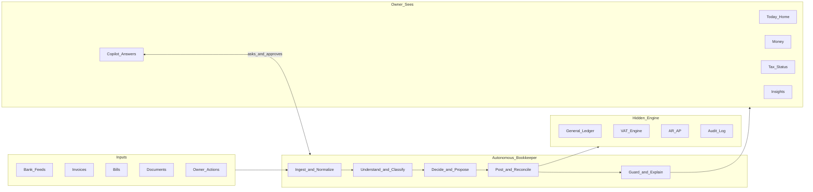
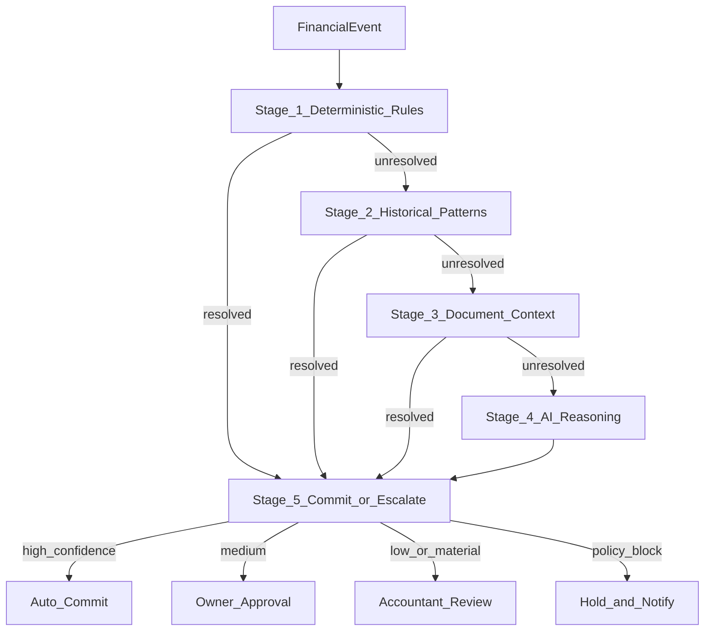
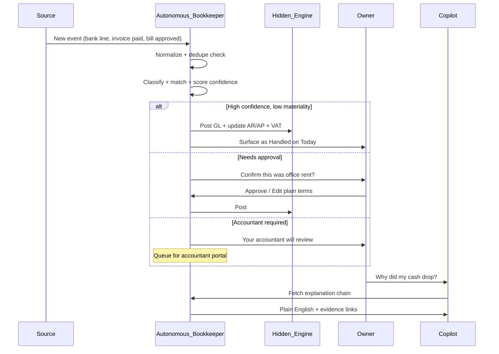
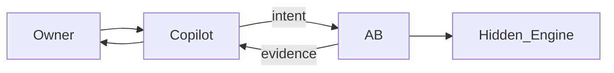
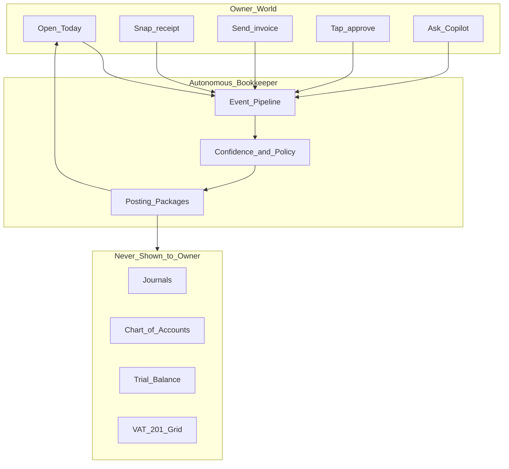

# Autonomous Bookkeeper — System Blueprint

**Sources:** [Due Diligence Audit Report](./due-diligence-audit.md) · [AI Financial OS Strategy](./ai-financial-os-strategy.md)  
**Role:** The single most important component of the future system — the invisible accountant that runs 24/7 behind owner-friendly surfaces.  
**Date:** June 2026  
**Status:** Design blueprint (business logic and system behaviour only — no implementation)

---

## Executive summary

Every other module is either an **input** (bank, invoices, bills, documents), an **output** (cash view, tax status, insights), or a **conversation layer** (Copilot). The **Autonomous Bookkeeper (AB)** is the only component that turns chaos into compliant financial truth.

Without it, you have a database of disconnected invoices, bank lines, and VAT periods — and an owner who must still think like an accountant to connect them.

With it, you have a **continuous close** — books always current, tax always knowable, cash always explainable — and an owner who only ever approves **business decisions**, never accounting artifacts.



---

## 1. Purpose

The Autonomous Bookkeeper exists to **maintain a complete, accurate, and tax-ready financial record of the business without the owner performing accounting work**.

It translates real-world economic events into the correct:

- Bank representation
- Customer/supplier document state
- VAT treatment
- General ledger entries (never shown to owner)
- Compliance posture

**For the owner:** “My finances are handled.”  
**For the system:** Every number in every owner screen is traceable to posted, auditable events.

**Strategic purpose:** Replace the accountant’s repetitive cognitive load (categorize, match, post, reconcile, calculate tax) while preserving human judgment on ambiguity, materiality, and trust.

---

## 2. Responsibilities

### 2.1 Core responsibilities (always on)

| Responsibility | Description |
|------------------|-------------|
| **Capture** | Accept events from bank feeds, owner actions, invoices, bills, receipts, and integrations |
| **Normalize** | Convert all inputs into a canonical `FinancialEvent` model |
| **Classify** | Assign business meaning: category, counterparty, VAT treatment, AR/AP link |
| **Match** | Link bank movements to invoices, bills, and prior events |
| **Post** | Create/update hidden GL entries, sub-ledger balances, VAT accumulators |
| **Reconcile** | Ensure bank, AR, AP, and VAT sub-ledgers agree with source documents |
| **Monitor** | Detect anomalies, duplicates, missing documents, period risks |
| **Explain** | Produce plain-English rationale for every decision |
| **Escalate** | Route items to owner approval or accountant review by policy |
| **Close readiness** | Keep books in a state where tax and reporting can run at any time |

### 2.2 Non-responsibilities (delegated elsewhere)

| Not AB’s job | Owner of |
|--------------|----------|
| Conversational UX | Finance Copilot |
| Sending invoice emails | Smart Invoicing module |
| Payment execution | Payments / PayFast integration |
| SARS eFiling submission | Tax Autopilot (future) + accountant |
| Business strategy advice | Copilot (with guardrails) |

---

## 3. Decision-making process

Every event passes through a **five-stage decision pipeline**. No stage may be skipped; later stages may override earlier ones only with logged reason.



### Stage 1 — Deterministic rules (highest authority)

- Bank rules (existing `BankRule` concept in current system)
- Exact reference matches (invoice number in bank reference)
- Known recurring transactions (rent, subscriptions)
- Hard policy blocks (period locked, duplicate hash, amount above limit)

### Stage 2 — Historical patterns

- “This looks like last 47 Nedbank service fees”
- Counterparty + amount clustering
- Seasonal patterns (monthly rent)

### Stage 3 — Document context

- Open invoice/bill amounts and dates
- Attached receipt OCR fields
- Email/thread metadata

### Stage 4 — AI reasoning (lowest automatic authority)

- Semantic classification (“consulting income”, “stationery”)
- Disambiguation when multiple matches possible
- VAT code inference from description (never overrides explicit document VAT)

### Stage 5 — Commit or escalate

Apply **confidence score + materiality + policy** → auto / owner / accountant / hold

**Golden rule:** AI may **propose**; only Stages 1–2 may **auto-commit** without owner involvement (subject to thresholds). Stages 3–4 default to approval unless confidence is exceptional and materiality is low.

---

## 4. Workflow: transaction capture → final posting

### 4.1 Canonical object: `FinancialEvent`

All inputs collapse into one internal event type:

| Field (conceptual) | Example |
|--------------------|---------|
| Source | bank / invoice / bill / receipt / manual |
| Direction | money_in / money_out |
| Amount | R8,500.00 |
| Date | 2026-06-18 |
| Counterparty | Acme Pharmacy |
| Description | Payment INV-1042 |
| Attachments | none |
| Proposed category | Sales income |
| Proposed VAT | Standard 15% |
| Links | invoice_id, bill_id, bank_txn_id |

Owners never see `FinancialEvent` — they see **“Customer payment from Acme”**.

### 4.2 End-to-end workflow



### 4.3 Detailed steps

| Step | Name | Behaviour |
|------|------|-----------|
| 1 | **Ingestion** | Bank feed, CSV, manual owner entry, invoice sent/paid, bill approved, receipt photographed → raw payload |
| 2 | **Normalization** | Parse amounts, dates, counterparty; detect currency; generate idempotency key |
| 3 | **Enrichment** | Lookup customer/supplier, open documents, historical categorizations, industry template |
| 4 | **Classification & matching** | Assign category + VAT; propose links (payment → Invoice #1042) |
| 5 | **Posting package assembly (hidden)** | Build balanced journal structure internally (see below) |
| 6 | **Sub-ledger update** | Invoice `amountPaid`, bill status, bank transaction → `handled` |
| 7 | **VAT accumulator update** | Roll into open period output/input buckets |
| 8 | **Commit or queue** | Auto-commit, owner queue, or accountant queue per policy |
| 9 | **Explain & notify** | Write audit record; push to Today feed; enable Copilot queries |

### 4.4 Hidden posting packages (owner never sees these)

| Economic event | Hidden effect (conceptual) |
|----------------|---------------------------|
| Bank receipt matched to invoice | Dr Bank, Cr Debtors (+ VAT split if applicable) |
| Supplier payment from bank | Dr Creditors, Cr Bank |
| Approved supplier bill | Dr Expense, Dr VAT input, Cr Creditors |
| Customer invoice issued | Dr Debtors, Cr Sales, Cr VAT output (on accrual basis) |

**Owner sees:** “R8,500 received — matched to Acme invoice” — not debits and credits.

---

## 5. Interactions with other modules

### 5.1 Banking

| Direction | Behaviour |
|-----------|-----------|
| **Bank → AB** | Every new/changed bank line triggers event pipeline |
| **AB → Bank** | Updates transaction with plain label, match status, “needs you” flag |
| **Owner sees** | “Money in/out” list — not NEW/REVIEWED/RECONCILED |
| **Hidden** | `journalEntryId` populated; reconciliation complete when matched + posted |

**Key behaviour:** Bank is the **source of truth for cash**; AB ensures every unexplained line gets resolved or escalated within SLA (e.g. 7 days).

### 5.2 Invoices (Get Paid)

| Trigger | AB action |
|---------|-----------|
| Invoice created | Reserve AR; no cash impact until paid (policy-dependent) |
| Invoice sent | No GL change; start collections clock |
| Bank payment received | Match → mark paid/partial → post Dr Bank Cr Debtors |
| Owner marks “paid by cash” | Create synthetic bank/cash event → same pipeline |
| Credit note (future) | Reverse posting package |

**Owner sees:** “Paid”, “Waiting”, “Overdue” — never debtors control account.

### 5.3 Bills (Pay)

| Trigger | AB action |
|---------|-----------|
| Bill captured (OCR/entry) | Draft liability; VAT input staged |
| Owner approves bill | Post Dr Expense/VAT, Cr Creditors |
| Payment from bank | Match → reduce creditors → Dr Creditors Cr Bank |
| Recurring bill detected | Propose approval rule for future auto-approve |

**Owner sees:** “To approve”, “Scheduled”, “Paid” — never creditors ledger.

### 5.4 VAT

| AB responsibility | Detail |
|-------------------|--------|
| Continuous accumulation | Every posted event updates period buckets |
| Code respect | Document VAT overrides AI inference |
| Period guard | Warn before close if unreconciled items exist |
| Owner surface | “Estimated VAT this period: R X due on [date]” |
| Hidden | VAT 201 field1/4/7/10/12/13/14 calculation |

**AB does not file with SARS in v1** — it prepares **filing-ready state** and plain summary.

### 5.5 Reporting

| Report type | AB role |
|-------------|---------|
| Owner insights | AB supplies narrative + numbers (“Your profit this month…”) |
| Cash flow | Derived from posted bank + scheduled bills |
| Tax summary | VAT position from accumulators |
| Hidden exports | Trial balance, GL detail — accountant portal only |

**Principle:** Reports read **posted truth** from AB; never recompute ad hoc in UI.

### 5.6 AI Copilot

| Copilot → AB | AB → Copilot |
|--------------|--------------|
| “What was that R500 charge?” | Explanation chain + counterparty |
| “Can I afford R20k equipment?” | Cash forecast + committed obligations |
| “Approve all similar rent txs” | Policy creation request (bounded) |
| “Send reminder to Acme” | Delegates to Collections; AB confirms AR state |

**Copilot never posts directly.** It issues **intents**; AB validates and executes.



---

## 6. Fully automated tasks

Automation requires **high confidence + low materiality + no policy block**.

| Task | Auto? | Condition |
|------|-------|-----------|
| Categorize known recurring bank fees | Yes | Rule or ≥20 identical history |
| Match bank payment to invoice (exact ref + amount) | Yes | Exact match |
| Post matched invoice payment | Yes | After match |
| Apply bank rule (text match) | Yes | Active rule exists |
| Mark duplicate import | Yes | Hash/idempotency key |
| Update VAT accumulators on post | Yes | Always when posted |
| Low-value rounding on invoices | Yes | < R1 tolerance |
| Weekly “all clear” brief generation | Yes | No open escalations |
| Allocate obvious subscription charges | Yes | Pattern + < R500 (configurable) |

**Owner experience:** Items appear in Today as **“Handled automatically ✓”** with tap-to-see plain explanation.

---

## 7. Human approval required (owner)

Medium confidence, materiality, or first-time patterns.

| Task | Why owner |
|------|-----------|
| New vendor first payment | Fraud risk |
| Uncategorized spend above threshold | Materiality (e.g. > R2,000) |
| Ambiguous match (2 open invoices) | Business fact required |
| New category assignment | Teaches system |
| Bill approval before post | Spending authority |
| Personal vs business ambiguity | Compliance |
| VAT treatment uncertain | Owner knows context |
| Anomaly flag (unusual amount) | Trust |

**UX pattern:** One card — *“Was this R15,000 payment for shop rent?”* → **[Yes, rent]** **[No, something else]**.

Never: “Select GL account 6100”.

---

## 8. Accountant review required

High materiality, regulatory complexity, or policy.

| Task | Why accountant |
|------|----------------|
| Period lock / reopen | Professional judgment |
| VAT period close & filing sign-off | Regulatory |
| Adjustments & reclassifications above threshold | Audit trail |
| Fixed asset capitalization | Tax/accounting rules |
| Bad debt write-off | VAT + income impact |
| Opening balances / migration | One-time |
| Multi-line compound entries AB can’t balance | Integrity |
| Owner dispute on AB decision | Escalation path |
| Year-end / annual financials | Statutory |

**Accountant portal sees:** journals, trial balance, VAT 201 grid — **owner never does**.

---

## 9. Confidence scoring methodology

### 9.1 Composite score (0–100)

```
Confidence = weighted(
  RuleMatch        × 0.35,
  HistoricalMatch  × 0.25,
  DocumentMatch    × 0.25,
  AIAgreement      × 0.15
)
```

| Signal | Score contribution |
|--------|-------------------|
| Exact rule hit | RuleMatch = 100 |
| Exact invoice ref + amount | DocumentMatch = 100 |
| 10+ identical past categorizations | HistoricalMatch = 95 |
| AI + rules agree | AIAgreement boost |
| Conflicting signals | Take minimum of top two |
| New counterparty | Cap at 60 |
| Amount above materiality threshold | Cap at 70 until approved once |

### 9.2 Decision thresholds

| Score | Materiality low | Materiality high |
|-------|-----------------|------------------|
| ≥ 92 | Auto-commit | Owner approve (first time) → then learn |
| 75–91 | Owner approve | Owner approve |
| 50–74 | Owner approve | Accountant queue |
| < 50 | Hold + ask owner | Accountant queue |

### 9.3 Materiality bands (default, configurable per business)

- **Low:** < R500
- **Medium:** R500 – R5,000
- **High:** > R5,000

**Learning:** Owner approval upgrades HistoricalMatch for that counterparty+description pattern; never auto-raises privilege on high-materiality without explicit “always trust this” rule.

---

## 10. Audit trail requirements

Every AB action produces an immutable **Decision Record**:

| Field | Purpose |
|-------|---------|
| `decision_id` | Unique identifier |
| `event_id` | Source financial event |
| `timestamp` | When decision occurred |
| `actor` | system / owner_id / accountant_id |
| `action` | classify / match / post / escalate / reverse |
| `confidence` | Score at decision time |
| `signals_used` | Rules, docs, AI model version |
| `before_state` | Snapshot hash |
| `after_state` | Snapshot hash |
| `posting_refs` | Hidden journal IDs |
| `explanation` | Plain English |
| `policy_version` | Which rules applied |

### Retention and compliance

- Append-only; reversals create **new** records linked to original
- 7-year retention (SA tax norm)
- Owner-visible: “Activity log” in plain language
- Accountant-visible: full technical audit + GL tie-out
- AI model version stamped on every AI-influenced decision

**Extends existing `AuditEvent`** from the due diligence audit — AB owns rich metadata; hidden engine stores postings.

---

## 11. Error handling and recovery

### 11.1 Error classes

| Class | Example | Recovery |
|-------|---------|----------|
| **E1 Ingestion** | Bank feed down | Retry with backoff; show “Bank syncing” |
| **E2 Duplicate** | Same txn imported twice | Idempotency reject; no double post |
| **E3 Imbalance** | Posting package won’t balance | Block; accountant queue |
| **E4 Period lock** | Post into closed period | Reject; suggest adjustment period |
| **E5 VAT conflict** | Doc says exempt, AI says standard | Hold; owner chooses |
| **E6 Match collision** | One payment, two invoices | Owner disambiguation |
| **E7 Partial data** | OCR missing amount | Draft bill; owner completes |
| **E8 Reversal** | Owner undo within 24h | Reverse posting package; linked audit |

### 11.2 Recovery principles

1. **Never silent failure** — every error → Today card or Copilot alert
2. **Fail closed on post** — unbalanced or ambiguous → no GL commit
3. **Reversible auto-actions** — 24-hour owner undo for auto-committed items
4. **Quarantine queue** — problematic events isolated; books remain valid
5. **Accountant unblock** — professional can release quarantined items

### 11.3 Health states (owner-visible)

| State | Meaning |
|-------|---------|
| All good | No open items > 48h |
| Needs you | N approvals waiting |
| Blocked | Accountant review or feed failure |

---

## 12. Trust and explainability requirements

### 12.1 Trust pillars

| Pillar | Requirement |
|--------|-------------|
| **Transparency** | Every auto action explainable in one sentence |
| **Control** | Owner can always override; system learns |
| **Proportionality** | More automation for small, repeated, low-risk |
| **Professional gate** | Material/tax items reach accountant |
| **No hallucinated money** | Copilot numbers must come from posted data |
| **Undo** | Clear reversal path |

### 12.2 Explainability template (every decision)

```
What: R125 Nedbank fee categorized as Bank Charges
Why: Matched your rule "service fee" (used 14 times before)
Effect: Reduces your cash; no VAT claim
Confidence: 97% — handled automatically
Change: [This wasn't a bank fee]
```

### 12.3 Vocabulary translation (owner vs hidden)

| Hidden concept | Owner sees instead |
|----------------|-------------------|
| Journal entry | “Recorded” |
| Debit/Credit | “Money in / Money out” |
| GL account 6100 Rent | “Rent” |
| Debtors control | “Customer owes you” / “Paid” |
| Creditors control | “You owe supplier” / “Paid” |
| Trial balance | “Your books are up to date ✓” |
| VAT field 4 | “VAT on sales this period” |
| Reconciliation | “Matched to invoice” |
| Posting | “Handled” |

### 12.4 Accountant mode (parallel universe)

Same AB, different lens:

- Sees journals, trial balance, VAT 201, audit chain
- Can approve, adjust, lock periods
- Owner notified only in outcomes: “Your accountant adjusted March rent — cash updated”

---

## Owner operating model (never sees accounting)



### A day in the life (behavioural story)

**07:30** — Owner opens **Today**. AB overnight: categorized 12 bank lines, matched 2 invoice payments, flagged 1 unknown R4,200 transfer.  
**Owner sees:** “1 thing needs you” — not 12 reconciliation items.

**07:32** — Owner taps: “Yes, that was payment to supplier XYZ for stock.” AB posts hidden entries, updates bill, VAT.  
**Owner sees:** “Done ✓”

**10:00** — Owner photographs delivery note. AB drafts bill; owner approves R3,400.  
**Owner never sees:** Dr Expense, Cr Creditors.

**15:00** — Owner asks Copilot: “How much tax this month?”  
AB returns from accumulators: “About R8,200 VAT payable — due 25 July.”

**Month-end** — AB prepares state; accountant reviews in portal; owner gets: “Your VAT return is ready for filing.”

**At no point:** journals, debits, credits, trial balance.

---

## Summary

| Without Autonomous Bookkeeper | With Autonomous Bookkeeper |
|------------------------------|----------------------------|
| Disconnected modules | Unified financial truth |
| Owner or accountant connects dots | System connects dots |
| AI is a chatbot on stale data | AI operates on live posted truth |
| GL optional / manual | GL always current, always hidden |
| Tax is a scary wizard | Tax is a status indicator |
| Product = accounting software | Product = financial operating system |

The Autonomous Bookkeeper is not a feature. It is the **operating conscience** of the platform — the reason an SME owner can run a business on the system without ever learning what a trial balance is.

---

## Related documents

- [Due Diligence Audit Report](./due-diligence-audit.md)
- [AI Financial OS Strategy](./ai-financial-os-strategy.md)
- [Screen Route Map](./screen-route-map.md)

---

*This blueprint describes business logic and system behaviour only. It aligns with the current kernel (GL, VAT, banking, AR/AP, audit) identified in the audit and the transformation intent in the strategy document.*
