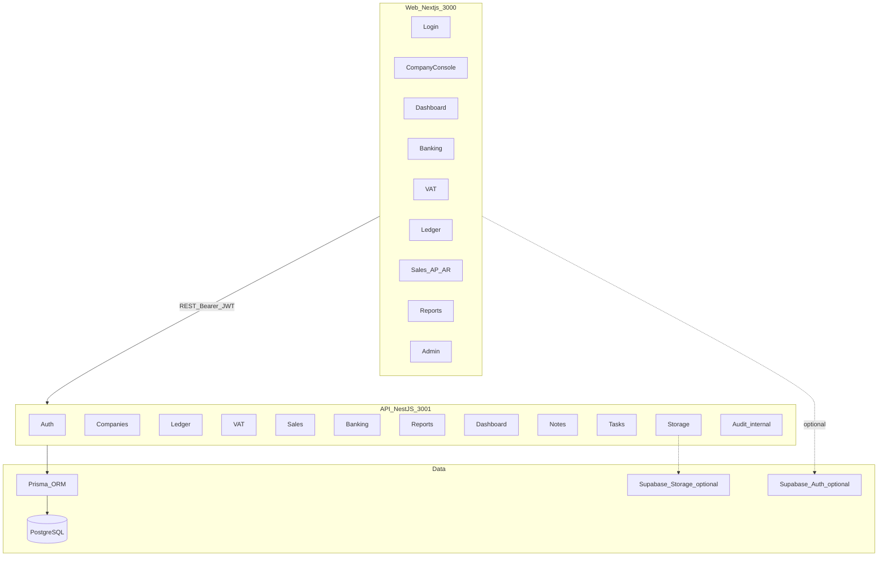
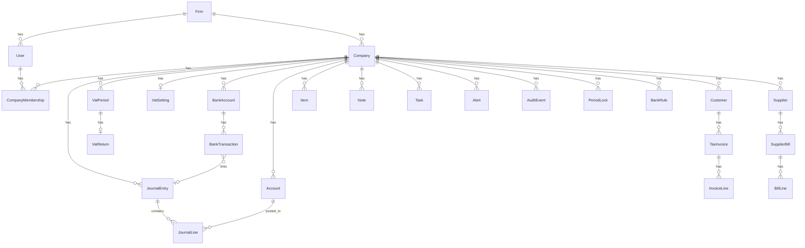

# SA Accountant Edition — Due Diligence Audit Report

**Product name:** SA Accountant Edition  
**Repository:** [`accounting-cursor`](../)  
**Audit date:** June 2026  
**Scope:** Full codebase (monorepo: `apps/web`, `apps/api`, `packages/db`, `packages/ui`, `docs`)

---

## Executive summary

This is an early-stage **South African practice accounting platform** aimed at accounting firms managing multiple client companies. It provides a firm console, per-company dashboards, general ledger, VAT 201 workflow, accounts receivable/payable document management, bank reconciliation, and six exportable reports. The stack is modern (Next.js 15, NestJS 10, Prisma 6, PostgreSQL). **Payroll, AI, and true inventory/stock management are not implemented.** Many API capabilities exist without corresponding UI, and several UI controls are placeholders.

---

## 1. Current modules and features

### 1.1 Monorepo structure

| Package | Path | Purpose |
|---------|------|---------|
| Web app | [`apps/web`](../apps/web) | Next.js 15 App Router frontend |
| API | [`apps/api`](../apps/api) | NestJS REST API (58 endpoints under `/api`) |
| Database | [`packages/db`](../packages/db) | Prisma schema, seed, client export |
| UI library | [`packages/ui`](../packages/ui) | Shared React components (DataTable, KpiCard, etc.) |
| Docs | [`docs`](.) | Route map, Supabase setup guide |

**Tooling:** pnpm workspaces, Turborepo, TypeScript, Tailwind CSS 4, Docker Compose (Postgres + Redis defined; Redis unused in code).

### 1.2 API modules (14 NestJS modules)

| Module | Files | Feature area |
|--------|-------|--------------|
| **Auth** | [`apps/api/src/auth/`](../apps/api/src/auth) | Login, JWT, optional Supabase token exchange, `/me` |
| **Companies** | [`apps/api/src/companies/`](../apps/api/src/companies) | Firm console, company detail/update |
| **Ledger** | [`apps/api/src/ledger/`](../apps/api/src/ledger) | Chart of accounts, journals, trial balance, period locks |
| **VAT** | [`apps/api/src/vat/`](../apps/api/src/vat) | VAT settings, periods, VAT 201 calculation, close/submit/payment workflow |
| **Sales** | [`apps/api/src/sales/`](../apps/api/src/sales) | Customers, suppliers, items, tax invoices, supplier bills, payment allocation |
| **Banking** | [`apps/api/src/banking/`](../apps/api/src/banking) | Bank accounts, transactions, rules, CSV import, reconciliation statuses |
| **Reports** | [`apps/api/src/reports/`](../apps/api/src/reports) | 6 report types, JSON/PDF/XLSX export |
| **Dashboard** | [`apps/api/src/dashboard/`](../apps/api/src/dashboard) | KPIs, cross-company search |
| **Notes** | [`apps/api/src/notes/`](../apps/api/src/notes) | Company notes CRUD |
| **Tasks** | [`apps/api/src/tasks/`](../apps/api/src/tasks) | Practice workflow tasks CRUD |
| **Storage** | [`apps/api/src/storage/`](../apps/api/src/storage) | Supabase file upload for bank statements |
| **Audit** | [`apps/api/src/audit/`](../apps/api/src/audit) | Internal audit logging (no HTTP API) |
| **Prisma** | [`apps/api/src/prisma/`](../apps/api/src/prisma) | Global Prisma provider |

### 1.3 Web routes (14 pages)

| Route | Page file | User-facing capability |
|-------|-----------|------------------------|
| `/` | [`apps/web/src/app/page.tsx`](../apps/web/src/app/page.tsx) | Redirect to `/console` |
| `/login` | [`apps/web/src/app/login/page.tsx`](../apps/web/src/app/login/page.tsx) | Split-screen login |
| `/console` | [`apps/web/src/app/console/page.tsx`](../apps/web/src/app/console/page.tsx) | Multi-client portfolio |
| `/dashboard` | [`apps/web/src/app/dashboard/page.tsx`](../apps/web/src/app/dashboard/page.tsx) | KPIs, notes, tasks, cash chart |
| `/banking` | [`apps/web/src/app/banking/page.tsx`](../apps/web/src/app/banking/page.tsx) | Accounts, reconciliation, file upload |
| `/vat` | [`apps/web/src/app/vat/page.tsx`](../apps/web/src/app/vat/page.tsx) | VAT periods, VAT 201, workflow steps |
| `/ledger` | [`apps/web/src/app/ledger/page.tsx`](../apps/web/src/app/ledger/page.tsx) | Accounts, journals, trial balance (read-only) |
| `/sales/customers` | [`apps/web/src/app/sales/customers/page.tsx`](../apps/web/src/app/sales/customers/page.tsx) | Customer list |
| `/sales/suppliers` | [`apps/web/src/app/sales/suppliers/page.tsx`](../apps/web/src/app/sales/suppliers/page.tsx) | Supplier list |
| `/sales/items` | [`apps/web/src/app/sales/items/page.tsx`](../apps/web/src/app/sales/items/page.tsx) | Product/service catalogue |
| `/sales/invoices` | [`apps/web/src/app/sales/invoices/page.tsx`](../apps/web/src/app/sales/invoices/page.tsx) | Tax invoice list |
| `/sales/bills` | [`apps/web/src/app/sales/bills/page.tsx`](../apps/web/src/app/sales/bills/page.tsx) | Supplier bill list |
| `/reports` | [`apps/web/src/app/reports/page.tsx`](../apps/web/src/app/reports/page.tsx) | Report catalog and export |
| `/admin` | [`apps/web/src/app/admin/page.tsx`](../apps/web/src/app/admin/page.tsx) | Read-only user profile; access control placeholder |

### 1.4 Shell / cross-cutting UI

- [`apps/web/src/components/app-shell.tsx`](../apps/web/src/components/app-shell.tsx) — Sidebar, company switcher, user menu, notifications bell (visual only)
- [`apps/web/src/components/command-palette.tsx`](../apps/web/src/components/command-palette.tsx) — Ctrl+K universal search
- [`packages/ui`](../packages/ui) — `PageHeader`, `DataTable`, `KpiCard`, `WorkflowSteps`, `MiniChart`, `StatusBadge`, `EmptyState`, ZAR/date formatters

### 1.5 Practice / workflow features (non-accounting)

- **Notes** — Accountant notes per company (API + dashboard UI)
- **Tasks** — Scheduled practice tasks with assignee, status, due dates (API + dashboard UI)
- **Alerts** — Stored in DB, surfaced on company console; **no alert management API or UI**
- **Company console** — Compliance badges, VAT due warnings, alert counts

---

## 2. Database structure and relationships

**Schema:** [`packages/db/prisma/schema.prisma`](../packages/db/prisma/schema.prisma)  
**ORM:** Prisma 6, PostgreSQL  
**Migrations:** No `prisma/migrations` folder — schema applied via `prisma db push` only  
**Seed:** [`packages/db/prisma/seed.ts`](../packages/db/prisma/seed.ts) — demo firm, 1 admin user, 4 companies, sample GL, bank, VAT, AR/AP data

### 2.1 Entity-relationship overview

### 2.2 Models (24 tables)

| Model | Purpose |
|-------|---------|
| `Firm` | Accounting practice tenant |
| `User` | Firm staff (email, optional password or Supabase link) |
| `Company` | Client business entity |
| `CompanyMembership` | User ↔ company access (many-to-many) |
| `Account` | GL chart (hierarchical via `parentId`) |
| `JournalEntry` / `JournalLine` | Double-entry journals |
| `BankAccount` / `BankTransaction` | Cash books and reconciliation |
| `BankRule` | Text-match categorization rules |
| `VatSetting` / `VatPeriod` / `VatReturn` | SA VAT configuration and VAT 201 fields |
| `Customer` / `Supplier` | AR/AP master data |
| `Item` | Product/service catalogue |
| `TaxInvoice` / `InvoiceLine` | Sales documents |
| `SupplierBill` / `BillLine` | Purchase documents |
| `Note` / `Task` | Practice workflow |
| `Alert` | Compliance notifications (seeded, read in console) |
| `AuditEvent` | Action audit log |
| `PeriodLock` | Accounting period lock dates |

### 2.3 Key enums

- `UserRole`: FIRM_ADMIN, ACCOUNTANT, BOOKKEEPER, CLIENT_READONLY
- `AccountType`: ASSET, LIABILITY, EQUITY, INCOME, EXPENSE
- `BankTransactionStatus`: NEW, REVIEWED, RECONCILED
- `VatPeriodStatus`: OPEN, CLOSED
- `VatSubmissionStatus`: NOT_SUBMITTED, SUBMITTED, PAID
- `JournalEntryStatus`: DRAFT, POSTED, VOID
- `InvoiceStatus` / `BillStatus`: lifecycle states including DRAFT, PAID, VOID

### 2.4 Notable schema fields

- SA-specific company fields: `vatRegistrationNumber`, `financialYearEndMonth/Day`, `vatFrequencyMonths` (default 2 = bi-monthly), `nextVatSubmissionDue`
- `BankTransaction.journalEntryId` — schema supports GL linkage; not populated by current services
- `User.supabaseAuthId` — optional link to Supabase Auth UUID
- `VatReturn.field1`–`field15` — VAT 201 form field storage (only subset populated by calculation)

---

## 3. Existing accounting functionality

### 3.1 General ledger

**API:** [`apps/api/src/ledger/ledger.service.ts`](../apps/api/src/ledger/ledger.service.ts)

| Capability | Status |
|------------|--------|
| Chart of accounts (list, create) | Implemented (API) |
| Hierarchical accounts (`parentId`) | Schema only; no tree UI/API logic |
| Journal entries (create with lines) | Implemented (API) |
| Debit/credit balance validation | Implemented (0.01 tolerance) |
| Draft vs posted journals | Implemented |
| Post journal | Implemented |
| Trial balance (as-of date) | Implemented (API + ledger UI) |
| Period locks | Implemented (API only) |
| Recurring journals | Schema flag `isRecurring`; no logic |

**UI:** [`apps/web/src/app/ledger/page.tsx`](../apps/web/src/app/ledger/page.tsx) — **read-only** lists; no create/edit journals or accounts in UI.

### 3.2 Sub-ledgers and document integration

| Area | GL integration |
|------|----------------|
| Tax invoices / supplier bills | **Not wired** — documents do not auto-post journal entries |
| Bank transactions | Schema link `journalEntryId` exists; **not populated** by banking service |
| Payment allocation | Updates `amountPaid` and status on invoices/bills only; **no GL posting** |

### 3.3 Banking / cash management

**API:** [`apps/api/src/banking/banking.service.ts`](../apps/api/src/banking/banking.service.ts)

- Bank account CRUD with opening balance and optional GL account link
- Transaction CRUD with spent/received amounts, payee, VAT code, GL selection
- Status workflow: NEW → REVIEWED → RECONCILED (bulk mark endpoints)
- CSV import with `importBatchId`
- Bank rules: text match → default account + VAT code (applied on transaction create)
- Running balance derived from opening balance + transactions (also used in dashboard KPIs)

**UI:** Partial — mark reviewed, file upload; mark reconciled and manual transaction create **not wired in UI**.

### 3.4 Accounts receivable / payable

**API:** [`apps/api/src/sales/sales.service.ts`](../apps/api/src/sales/sales.service.ts)

- Customer and supplier master data (list, create)
- Tax invoices and supplier bills with line items
- VAT at fixed 15% on all lines (`VAT_RATE = 0.15`)
- Payment allocation endpoints update paid amounts and status

**UI:** All sales pages are **read-only lists** — no create invoice/bill/customer UI despite API support.

---

## 4. Existing tax functionality

**Focus:** South African VAT (not income tax, PAYE, or customs).

### 4.1 VAT configuration

- Per-company `VatSetting` (standard rate default 15%, frequency months, registration number)
- Company-level VAT registration, bi-monthly frequency (`vatFrequencyMonths: 2`), submission due dates

### 4.2 VAT periods and VAT 201

**API:** [`apps/api/src/vat/vat.service.ts`](../apps/api/src/vat/vat.service.ts)

| Step | Implementation |
|------|----------------|
| List periods | Yes |
| Calculate VAT 201 | Aggregates `TaxInvoice` and `SupplierBill` in period date range |
| Field mapping | field1 (output excl VAT), field4 (output VAT), field7 (input excl VAT), field10 (input VAT), field12 (net), field13 (payable), field14 (refundable) |
| Close period | Blocks if unreconciled bank transactions exist |
| Mark submitted | Updates `submissionStatus`, `submittedAt` |
| Link payment | Sets `paymentLinked`, status PAID |
| Reopen period | Reverts CLOSED → OPEN |

**Not implemented in calculation:** Zero-rated/exempt splits, field2/3/5/6/8/9/11/15, adjustments, bad debt relief, import VAT, etc.

### 4.3 VAT in sales documents

- All invoice/bill lines use flat 15% VAT regardless of `vatCode` string on line
- `vatCode` stored as free-text (e.g. "Standard Rate", "Exempt") — **not used in tax math**

### 4.4 UI

[`apps/web/src/app/vat/page.tsx`](../apps/web/src/app/vat/page.tsx) — 5-step workflow display, calculate, close period, VAT 201 modal. **"Mark submitted" and "Link payment" buttons are UI-only** (API exists but not called).

---

## 5. Existing inventory functionality

**Status: Catalogue only — not inventory management.**

| Exists | Does not exist |
|--------|----------------|
| `Item` model: code, description, unitPrice, vatCode, isActive | Stock quantities on hand |
| API: list/create items | Warehouses, bins, locations |
| UI: read-only item list | Stock movements, adjustments, transfers |
| Line items on invoices/bills (description, qty, price) | COGS posting, FIFO/weighted average |
| Seed includes sample items | Purchase orders, goods received notes |
| Account type EXPENSE includes "Cost of Sales" in seed COA | BOM, assemblies, serial tracking |

The `Item` entity is a **product/service price list**, not an inventory subsystem.

---

## 6. Existing payroll functionality

**Status: Not implemented.**

No models, API endpoints, UI pages, or seed data for:

- Employees, employment contracts, departments
- Payslips, pay runs, PAYE/UIF/SDL
- Leave, timesheets, benefits
- IRP5, EMP201, or SA payroll tax tables

The `Task` model is **practice workflow** (accountant to-dos), not payroll tasks.

---

## 7. Existing AI functionality

**Status: Not implemented.**

No evidence in codebase of:

- LLM / OpenAI / Anthropic / Azure AI integrations
- ML-based bank categorization (rules are deterministic text match only)
- Document OCR / invoice extraction
- Natural language query or copilot features
- AI-related dependencies or environment variables

---

## 8. Existing reporting functionality

**API:** [`apps/api/src/reports/reports.service.ts`](../apps/api/src/reports/reports.service.ts)  
**UI:** [`apps/web/src/app/reports/page.tsx`](../apps/web/src/app/reports/page.tsx)

| Report ID | Name | Data source | Formats |
|-----------|------|-------------|---------|
| `trial-balance` | Trial Balance | Posted journal lines | JSON, PDF, XLSX |
| `vat-summary` | VAT Summary | VAT periods + returns | JSON, PDF, XLSX |
| `customer-balances` | Customer Balances | Invoice totals vs paid (groupBy) | JSON, PDF, XLSX |
| `supplier-balances` | Supplier Balances | Bill totals vs paid (groupBy) | JSON, PDF, XLSX |
| `bank-transactions` | Bank Transactions | All bank transactions | JSON, PDF, XLSX |
| `audit-trail` | Audit Trail | Last 500 audit events | JSON, PDF, XLSX |

**PDF generation:** PDFKit renders JSON string dump (not formatted financial statements).  
**Not available:** P&L, balance sheet, cash flow statement, aged debtors/creditors, management accounts, SARS eFiling export, fixed asset register.

**Dashboard KPIs** ([`dashboard.service.ts`](../apps/api/src/dashboard/dashboard.service.ts)): cash position, unreconciled count, VAT payable, overdue AR/AP counts.

---

## 9. Existing APIs and integrations

### 9.1 REST API surface

- **Base URL:** `http://localhost:3001/api` (configurable via `API_PORT`, `NEXT_PUBLIC_API_URL`)
- **58 HTTP endpoints** across 11 controllers
- **Auth:** Bearer JWT in `Authorization` header
- **Tenancy:** `x-company-id` header on company-scoped routes
- **CORS:** Enabled for `WEB_URL` (default `http://localhost:3000`)

### 9.2 Web API client

[`apps/web/src/lib/api.ts`](../apps/web/src/lib/api.ts) — central fetch wrapper with token/company persistence in `localStorage`.

### 9.3 External integrations

| Integration | Status | Usage |
|-------------|--------|-------|
| **PostgreSQL** | Active | Primary datastore (local Docker, Prisma dev, or Supabase) |
| **Supabase Auth** | Optional | `NEXT_PUBLIC_SUPABASE_*`, `SUPABASE_JWT_SECRET`; browser login → `/auth/supabase` |
| **Supabase Storage** | Optional | Bank statement file upload via service role key |
| **Redis** | Defined in docker-compose only | **Not used** in application code |
| **SARS eFiling** | None | — |
| **Bank feeds (Yodlee, etc.)** | None | Manual CSV import + optional file upload |
| **Payment gateways** | None | — |
| **Email (SMTP)** | None | — |
| **Webhooks / third-party APIs** | None | — |

### 9.4 Documentation

- [`docs/screen-route-map.md`](screen-route-map.md) — Sage screen parity map
- [`docs/supabase-setup.md`](supabase-setup.md) — Supabase connection and auth setup
- [`README.md`](../README.md) — Quick start (Docker, Supabase, Prisma dev options)

---

## 10. Security architecture

### 10.1 Authentication

[`apps/api/src/auth/auth.service.ts`](../apps/api/src/auth/auth.service.ts)

- **Local auth:** bcrypt password hash, NestJS JWT (7-day expiry, `JWT_SECRET`)
- **Supabase auth:** HS256 verification via `SUPABASE_JWT_SECRET`; links `supabaseAuthId` by email on first login
- **Token resolution:** Supabase path tried first when configured, else local JWT
- **Web persistence:** `localStorage` keys `token`, `companyId`

### 10.2 Authorization

[`apps/api/src/auth/jwt.strategy.ts`](../apps/api/src/auth/jwt.strategy.ts)

- `JwtAuthGuard` on protected routes via `@Auth()` decorator
- `assertCompanyAccess()` — verifies `CompanyMembership` for `userId` + `companyId`
- **Firm-level isolation:** Company console filters by `user.firmId` from JWT user object
- **No role-based endpoint guards** — `UserRole` enum stored and returned in `/me` but **not enforced** on API routes

### 10.3 Web security

- **No Next.js middleware** — route protection is client-side only in [`auth-context.tsx`](../apps/web/src/lib/auth-context.tsx)
- Reports export passes token and companyId as **query string parameters**
- Demo credentials pre-filled on login page

### 10.4 Data validation

- Auth login DTOs use `class-validator`
- Most other POST/PATCH bodies accept `Record<string, unknown>` cast to Prisma — **minimal server-side validation**

### 10.5 Audit

- `AuditService` logs CREATE, CALCULATE, CLOSE, LOCK_PERIOD, IMPORT actions
- Audit readable via reports only; no dedicated audit API

### 10.6 Storage security

- Supabase uploads use **service role key** server-side only
- Private bucket pattern documented; signed URLs (1-hour) returned on upload
- Path structure: `{companyId}/bank-statements/{accountId}/`

---

## 11. User roles and permissions

### 11.1 Defined roles ([`schema.prisma`](../packages/db/prisma/schema.prisma))

| Role | Intended use (inferred from name) |
|------|-----------------------------------|
| `FIRM_ADMIN` | Practice administrator |
| `ACCOUNTANT` | Default role; full staff access |
| `BOOKKEEPER` | Limited bookkeeping |
| `CLIENT_READONLY` | Client portal read-only |

### 11.2 What is actually enforced

| Mechanism | Enforced? |
|-----------|-----------|
| Valid JWT / Supabase token | Yes |
| Company membership for `x-company-id` | Yes |
| Firm scoping on console list | Yes (via user's `firmId`) |
| Role-based read/write restrictions | **No** |
| Per-module permissions | **No** |
| Client self-service portal | **No** (role exists, no separate UI) |
| User administration | **No** (admin page is placeholder) |

### 11.3 Multi-tenancy model

- **Firm** → many **Companies** → many **Users** via **CompanyMembership**
- Single demo user in seed has membership on all 4 companies
- Company switcher in UI changes `x-company-id` context

---

## 12. Strengths of the current system

1. **Clear domain focus** — Built specifically for SA accounting practices (ZAR, bi-monthly VAT, VAT 201, firm console).
2. **Modern, maintainable stack** — TypeScript monorepo, Prisma, NestJS modules, shared UI package.
3. **Solid data model foundation** — 24 Prisma models cover GL, VAT, AR/AP, banking, audit, and practice workflow with appropriate relationships and indexes.
4. **Multi-tenant architecture** — Firm/company/membership model with consistent `assertCompanyAccess` pattern across services.
5. **API breadth ahead of UI** — Backend supports journal creation, AR/AP document creation, banking import, VAT workflow — providing expansion surface.
6. **Bank reconciliation workflow** — Status pipeline, rules engine, CSV import, VAT period close gated on reconciliation.
7. **Dual auth path** — Local JWT for dev plus optional Supabase Auth without rewriting business logic.
8. **Audit trail infrastructure** — `AuditEvent` model and service integrated into key mutations.
9. **UX polish for stage** — Command palette, KPI dashboard, workflow steps, compliance badges, responsive shell.
10. **Documentation exists** — README, Supabase guide, screen-route map from Sage reference.

---

## 13. Weaknesses of the current system

1. **UI/API parity gap** — Most sales, ledger, and VAT workflow actions exist only in API; web is predominantly read-only.
2. **Accounting subsystems not integrated** — Invoices, bills, and bank transactions do not post to GL; trial balance reflects journals only.
3. **No automated test suite** — Zero project-owned unit, integration, or E2E tests.
4. **No Prisma migrations** — `db push` only; no versioned migration history for production deployments.
5. **Role model is decorative** — Four roles defined but not enforced; any member has full API access.
6. **Client-side auth only** — No server middleware; tokens in localStorage; brief unauthenticated flash possible.
7. **VAT calculation is simplified** — Flat 15% on all lines; VAT codes ignored; partial VAT 201 field set.
8. **PDF reports are rudimentary** — JSON serialized to PDF, not presentation-quality financial statements.
9. **Placeholder UI elements** — Add company, notifications, VAT submit/payment, user access admin, partial dashboard chart data.
10. **Single-user seed** — No demonstration of multi-user permissions or firm staff management.
11. **Redis provisioned but unused** — Infrastructure mismatch in docker-compose.
12. **Input validation weak** — Most endpoints accept untyped JSON bodies.

---

## 14. Technical debt

| Area | Description |
|------|-------------|
| **Package exports** | `@accounting/db` required build to `dist/` — `export *` from Prisma overwrote `prisma` singleton when loading raw TS |
| **DI pattern** | Services use `prisma` singleton directly instead of injected `PrismaService`; prior circular-import issues with `app.module` |
| **Env loading** | Multiple dotenv strategies (root `dotenv-cli`, `apps/api/src/env.ts`, `packages/db` cwd-based paths) |
| **Type safety** | Widespread `Record<string, unknown>` + `as never` casts to Prisma |
| **Hardcoded constants** | VAT rate 0.15 in code vs `VatSetting.standardRate` in DB |
| **NestJS Passport** | `PassportModule` registered in app module but custom `JwtAuthGuard` replaced Passport JWT strategy |
| **Global modules** | Both `AuthModule` and `PrismaModule` marked `@Global()` |
| **No CI/CD** | No GitHub Actions, lint gates, or deployment configs observed |
| **No API versioning** | Flat `/api` namespace |
| **Report auth** | Token passed in URL query params for PDF/XLSX download |
| **Schema vs code drift** | Fields like `isRecurring`, `journalEntryId`, `Alert` model partially utilized |
| **Prisma config deprecation** | `package.json#prisma` seed config flagged for Prisma 7 migration |

---

## 15. Missing functionality

Factual inventory of capabilities **not present** in the codebase (grouped by domain):

### Core accounting
- Balance sheet, income statement, cash flow statement
- Automated GL posting from AR/AP/banking
- Bank reconciliation to GL (beyond status flags)
- Fixed assets, depreciation
- Multi-currency
- Consolidation across companies
- Budgeting and forecasting
- Recurring journal automation

### Tax (beyond basic VAT 201)
- Income tax / provisional tax
- PAYE, UIF, SDL (payroll taxes)
- WHT, donations tax
- Full VAT 201 field coverage and SARS eFiling integration
- Tax code engine (zero-rated, exempt, capital goods)

### Inventory
- Stock on hand, warehouses, stock takes
- Inventory valuation and COGS automation
- Purchase orders, GRNs

### Payroll
- Entire payroll domain (see Section 6)

### AI / automation
- Entire AI domain (see Section 7)

### CRM / operations
- Projects, time billing
- Purchase requisitions
- Expense claims

### Platform
- User/role administration UI
- Alert management API/UI
- Email notifications
- Document management (beyond bank statement upload)
- Mobile app
- Offline mode
- API rate limiting, request logging
- Backup/restore procedures in code
- Production deployment configuration

### Sage parity (from route map — implemented routes exist but depth varies)
- Deep GL transaction entry UI
- Full bank feed automation
- Complete administration module

---

## Appendix: Demo data summary (seed)

- **Firm:** Demo Accounting Firm
- **User:** admin@demo.co.za / password123 (FIRM_ADMIN)
- **Companies:** 4 (pharmacy/trading examples with SA VAT numbers)
- **Primary company seed:** 9 GL accounts, Nedbank account, 3 bank transactions, 1 bank rule, open VAT period 05/2026 with precalculated return, customers, suppliers, items, invoices, bills, notes, tasks, alerts

---

*This report documents existing state only. No recommendations or roadmap are included.*
