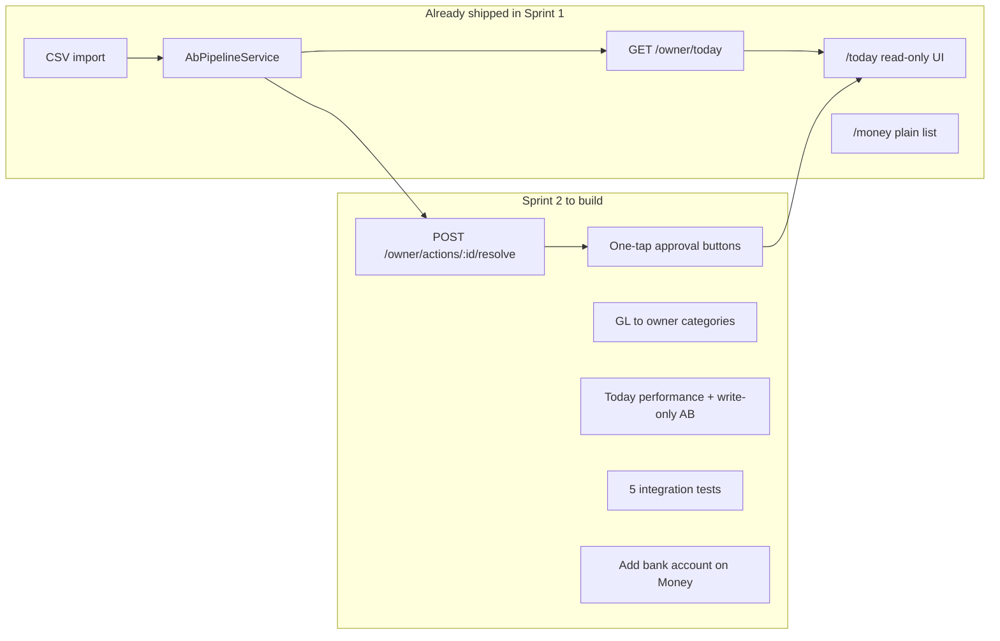

# Sprint 2 Plan — Today + Approvals (Killer Feature)

**Sprint:** Days 15–28  
**Source plan:** [MVP Gap Analysis — Sprint 2](./ai-financial-os-mvp-gap-analysis.md#sprint-2-days-1528--today--approvals-killer-feature)  
**Baseline:** [Sprint 1 Completion Report](./sprint-1-completion-report.md)  
**Product name (working):** VonHelm  
**Status:** **In progress** — resolve API, approval buttons, read-path cleanup, and bank account UI implemented; integration tests and performance target remain.

---

## Owner confusion mitigations

Sprint 2 must reduce owner friction without scope creep. These mitigations are **required**, not optional polish.

| Area | Owner friction | Mitigation (Sprint 2) |
|------|----------------|------------------------|
| **Approval wording** | "Yes" sounds like categorization, but txn has no category | Reframe question as uncertainty check; helper copy: confirming does not pick a category yet |
| **Approval outcomes** | "Yes" and "Sorted ✓" look the same | Split badges: **Confirmed ✓** (owner said payment looks correct) vs **Sorted ✓** (matched to category) |
| **Dismiss ("No")** | Same question reappears after "No" | `DISMISSED` status; AB pipeline skips re-queue if dismissed |
| **Card count** | 10 cards shown but banner says higher count | Cap display at 3; show **"Showing X of Y"** when total pending exceeds cap |
| **Categories** | No picker in Sprint 2 | Honest copy on approval cards; never show "Sorted" without `selectionId` |
| **Errors** | Generic Today/resolve failures | Specific resolve error copy; refresh Today only after successful resolve (no optimistic removal) |
| **Repeat payees** | Same payee, no date in question | Include transaction date in approval question (`buildApprovalQuestion`) |
| **Counts** | "Sorted automatically" includes owner-confirmed txns | Split `sortedCount` vs `confirmedCount` in API and Today UI |
| **Learning** | No ML in Sprint 2 | Store resolve metadata (`selectedChoice`, `resolvedAt`, `resolvedByUserId`) for Sprint 3+ |

**Implementation touchpoints:** `owner.constants.ts`, `ab-pipeline.service.ts`, `owner.service.ts`, `today/page.tsx`, `money/page.tsx`.

---

## Executive summary

Sprint 2 completes the **"while you slept"** moment: owners open **Today**, see cash and what was handled overnight, and **resolve approval cards in one tap**.

Sprint 1 already pulled forward the read surfaces (`GET /owner/today`, `/today` page, Money list, `OwnerAction` queue creation). Sprint 2 focuses on making approvals **actionable** — not just visible.

| Sprint 2 acceptance criterion | Status |
|------------------------------|--------|
| Today loads < 3s with 50 txns | ❌ Not measured |
| "N needs you" matches open `OwnerAction` count | ✅ Count + cap display |
| One-tap approval clears card and updates activity | ✅ Implemented |
| Zero owner-facing jargon (debit, credit, reconcile, journal) | ⚠️ Mostly done on Today/Money |

**Day 30 gate:** Real company CSV → Today loads < 3s → one approval completes end-to-end.

---

## Objective

Deliver the killer feature: **Today + one-tap approvals**.

---

## Already done (pulled forward from Sprint 1)

| Item | Status | Key files |
|------|--------|-----------|
| `GET /owner/today` | Done (trust-shaped response) | `apps/api/src/owner/owner.service.ts`, `owner-today-trust.ts` |
| `/today` page shell | Done (read-only) | `apps/web/src/app/today/page.tsx` |
| Money tab v0 | Done | `apps/web/src/app/money/page.tsx` |
| `OwnerAction` queue creation | Done | `apps/api/src/owner/ab-pipeline.service.ts` |
| Pending cards displayed | Done (no buttons) | Today page "Needs you" section |
| Today trust fixes | Done | Separate bank/VAT cards, queue banner, confidence scoring |

**Still missing:** resolve endpoint, approval buttons, category mapping on resolve, integration tests, performance target.

---

## Deliverables

### 1. Approval resolve API (P0)

**`POST /api/owner/actions/:id/resolve`**

- Auth: JWT + `x-company-id` (same as other owner routes)
- Body: `{ choice: string }` matching one of the action's `choices`
- Behaviour:
  - Mark `OwnerAction` as `RESOLVED`; set `selectedChoice`, `resolvedAt`, `resolvedByUserId`
  - On **"Yes, that's right"**: mark linked `BankTransaction` as `REVIEWED` (optionally set `selectionId` if inferable)
  - On **"No, something else"**: minimal v1 — dismiss action and leave txn for re-queue; full category picker is stretch or early Sprint 3
- Return `{ ok: true }` or updated summary so the web client can refresh Today

**Files:**

| File | Change |
|------|--------|
| `apps/api/src/owner/owner.controller.ts` | New route |
| `apps/api/src/owner/owner.service.ts` | `resolveAction(userId, companyId, actionId, choice)` |
| `apps/web/src/lib/api.ts` | `resolveOwnerAction(id, choice)` |

### 2. One-tap approval buttons on Today (P0)

Wire read-only cards in `apps/web/src/app/today/page.tsx`:

- Render each action's `choices` as full-width buttons (max 2)
- On tap: call resolve API → remove card / refresh Today
- Loading + error states on failure
- UX reference: [Owner UX Architecture — approvals on Today](./ai-financial-os-ux-architecture.md)

### 3. Plain-language category mapping (P1)

Map ledger/GL account names to owner-friendly labels:

- **"Rent"** not **"6100 Rent Expense"**
- Extend `plainCategory()` in `owner.service.ts` for activity feed and resolve outcomes
- Apply on Money list where accountant codes still leak through

### 4. Today performance + pipeline hygiene (P1)

- **Stop re-running AB pipeline on every `GET /owner/today`** — process only on write (import/create)
- Target: Today loads in **under 3 seconds** with 50 transactions
- Reduce N+1 in `getToday` aggregation
- Optional: brief cache on Today payload

### 5. Bank account creation on Money (P1 — Sprint 1 carry-over)

Greenfield owners need this before CSV import works without seed data:

- Minimal "Add bank account" form on `apps/web/src/app/money/page.tsx`
- Wire to existing `POST /banking/accounts` (`createBankAccount` already in `api.ts`)

### 6. Integration tests (P1)

Five tests covering the full owner loop:

1. CSV import creates transactions
2. Uncategorized txn creates `OwnerAction` (`PENDING`)
3. Categorized txn auto-handles (no pending action)
4. Resolve with "Yes, that's right" clears action + marks txn handled
5. Today `pendingApprovalCount` matches DB count

Suggested location: `apps/api/test/owner/`

### 7. Owner language cleanup (P2)

Audit owner surfaces for accountant jargon:

- `apps/web/src/components/owner-shell.tsx`
- `apps/web/src/app/today/page.tsx`
- `apps/web/src/app/money/page.tsx`

Legacy accountant routes (`/ledger`, `/console`, etc.) remain reachable by URL but are out of scope.

### 8. Baseline migration (P2 — recommended before staging)

- Replace `db push`-only workflow with baseline Prisma migration
- Reference: `packages/db/prisma/migrations/20260620_sprint1_owner_actions/migration.sql`

---

## Acceptance criteria

- [ ] Today loads **< 3s** with 50 txns
- [x] **"N needs you"** / queue pending count matches open `OwnerAction` rows
- [x] **One-tap approval** clears card and updates activity/handled counts
- [ ] **Zero owner-facing jargon**: debit, credit, reconcile, journal

---

## Explicitly NOT Sprint 2

| Feature | Sprint |
|---------|--------|
| Owner signup / onboarding wizard | Sprint 3 |
| Invoice create + Get Paid tab | Sprint 3 |
| Bill capture + Pay tab | Sprint 4 |
| GL wire (journal on approve) | Sprint 4 |
| Aria Q&A widget | Sprint 5 |
| Stripe/Paystack billing | Sprint 5 |

---

## Suggested implementation order

1. Resolve API + service logic
2. Today approval buttons + API client
3. Remove AB pipeline from Today read path
4. Bank account UI on Money
5. Category mapping pass on activity/Money labels
6. Integration tests
7. Performance check at 50 txns; baseline migration if time allows

---

## API endpoints

### New

| Method | Path | Purpose |
|--------|------|---------|
| `POST` | `/owner/actions/:id/resolve` | Resolve approval with owner choice |

### Existing (used by Sprint 2)

| Method | Path | Purpose |
|--------|------|---------|
| `GET` | `/owner/today` | Today aggregation (read) |
| `GET` | `/owner/health` | Tenancy check |
| `POST` | `/banking/accounts` | Create bank account (Money onboarding) |
| `POST` | `/banking/accounts/:id/import` | CSV import |

---

## Related documents

| Doc | Link |
|-----|------|
| Sprint 1 report | [sprint-1-completion-report.md](./sprint-1-completion-report.md) |
| Gap analysis (Sprint 2) | [ai-financial-os-mvp-gap-analysis.md](./ai-financial-os-mvp-gap-analysis.md) |
| Today trust fixes | [today-trust-fixes-plan.md](./today-trust-fixes-plan.md) |
| AB design | [autonomous-bookkeeper-blueprint.md](./autonomous-bookkeeper-blueprint.md) |
| Owner UX | [ai-financial-os-ux-architecture.md](./ai-financial-os-ux-architecture.md) |
| Launch plan (Day 30 gate) | [ai-financial-os-mvp-launch-plan.md](./ai-financial-os-mvp-launch-plan.md) |
